# Table of contents

- [Table of contents](#table-of-contents)
- [Week 01 - Hello, Deep Learning. Implementing a Multilayer Perceptron](#week-01---hello-deep-learning-implementing-a-multilayer-perceptron)
  - [Administrative](#administrative)
  - [What is deep learning?](#what-is-deep-learning)
  - [Modeling a neuron that can multiply by 2](#modeling-a-neuron-that-can-multiply-by-2)
  - [Python Packages](#python-packages)
    - [What are packages in Python?](#what-are-packages-in-python)
    - [Importing means executing the script](#importing-means-executing-the-script)
  - [NumPy](#numpy)
    - [0. Importing](#0-importing)
    - [1. Array Creation](#1-array-creation)
    - [2. Array Attributes and Inspection](#2-array-attributes-and-inspection)
    - [3. Array Manipulation](#3-array-manipulation)
    - [4. Indexing, Slicing, and Iteration](#4-indexing-slicing-and-iteration)
    - [5. Mathematical and Universal Functions (`ufuncs`)](#5-mathematical-and-universal-functions-ufuncs)
    - [6. Linear Algebra](#6-linear-algebra)
    - [7. Statistical Functions](#7-statistical-functions)
    - [8. Broadcasting](#8-broadcasting)
    - [9. Random Number Generation](#9-random-number-generation)
    - [10. File I/O and Miscellaneous](#10-file-io-and-miscellaneous)
  - [Matplotlib](#matplotlib)
    - [Line plot](#line-plot)
    - [Scatter plot](#scatter-plot)
    - [Drawing multiple plots on one figure](#drawing-multiple-plots-on-one-figure)
    - [The logarithmic scale](#the-logarithmic-scale)
    - [Histogram](#histogram)
      - [Introduction](#introduction)
      - [In `matplotlib`](#in-matplotlib)
      - [Use cases](#use-cases)
    - [Checkpoint](#checkpoint)
    - [Customization](#customization)
      - [Axis labels](#axis-labels)
      - [Title](#title)
      - [Ticks](#ticks)
      - [Adding more data](#adding-more-data)
      - [`plt.tight_layout()`](#plttight_layout)
        - [Problem](#problem)
        - [Solution](#solution)
  - [Random numbers](#random-numbers)
    - [Context](#context)
    - [Random generators](#random-generators)
  - [Code formatting](#code-formatting)
  - [Behavior-driven development](#behavior-driven-development)
- [Week 02 - Implementing Gradient Descent](#week-02---implementing-gradient-descent)
  - [Backpropagation](#backpropagation)
  - [Topological sort](#topological-sort)
  - [Activation functions](#activation-functions)
  - [Python OOP (Magic Methods)](#python-oop-magic-methods)
    - [Initialization and Construction](#initialization-and-construction)
    - [Arithmetic operators](#arithmetic-operators)
    - [String Magic Methods](#string-magic-methods)
    - [Comparison magic methods](#comparison-magic-methods)
  - [Introducing `dl_lib`](#introducing-dl_lib)
- [Week 03 - Hello, PyTorch](#week-03---hello-pytorch)
  - [The (typical) Modelling Workflow](#the-typical-modelling-workflow)
  - [Creating The Neural Network](#creating-the-neural-network)
    - [Creating Tensors](#creating-tensors)
    - [Useful Attributes](#useful-attributes)
    - [Shapes matter](#shapes-matter)
    - [Multiplication](#multiplication)
    - [Our First Neural Network](#our-first-neural-network)
    - [Stacking Layers With `nn.Sequential()`](#stacking-layers-with-nnsequential)
  - [Activation Functions](#activation-functions-1)
    - [Binary Classification](#binary-classification)
    - [Multiclass Classification](#multiclass-classification)
    - [Fighting vanishing gradients](#fighting-vanishing-gradients)
  - [Loss Functions](#loss-functions)
    - [Cross-entropy Loss in PyTorch](#cross-entropy-loss-in-pytorch)
    - [Backpropagation](#backpropagation-1)
  - [Optimizers](#optimizers)
    - [Stochastic gradient descent](#stochastic-gradient-descent)
    - [Stochastic gradient descent with momentum](#stochastic-gradient-descent-with-momentum)
    - [AdaGrad](#adagrad)
    - [RMSprop](#rmsprop)
    - [Adam](#adam)
    - [AdamW](#adamw)
  - [Metrics](#metrics)
    - [Calculating validation loss](#calculating-validation-loss)
    - [The Bias-Variance Tradeoff](#the-bias-variance-tradeoff)
  - [How to count model parameters](#how-to-count-model-parameters)
    - [Layer naming conventions](#layer-naming-conventions)
    - [PyTorch's `numel` method](#pytorchs-numel-method)
  - [Tips For Training Neural Networks](#tips-for-training-neural-networks)
    - [Fighting overfitting](#fighting-overfitting)
    - [Using a `Dropout` layer](#using-a-dropout-layer)
    - [Data augmentation](#data-augmentation)
    - [Steps to maximize model performance](#steps-to-maximize-model-performance)
      - [Step 1: overfit the training set](#step-1-overfit-the-training-set)
      - [Step 2: reduce overfitting](#step-2-reduce-overfitting)
      - [Step 3: fine-tune hyperparameters](#step-3-fine-tune-hyperparameters)
  - [The Model Report File](#the-model-report-file)
- [Week 04 - Convolutional Neural Networks. Building multi-input and multi-output models](#week-04---convolutional-neural-networks-building-multi-input-and-multi-output-models)
  - [Custom Datasets in PyTorch](#custom-datasets-in-pytorch)
  - [Class-Based PyTorch Model](#class-based-pytorch-model)
  - [Working with images in PyTorch](#working-with-images-in-pytorch)
    - [The Clouds dataset](#the-clouds-dataset)
    - [Converting pixels to tensors and tensors to pixels](#converting-pixels-to-tensors-and-tensors-to-pixels)
    - [Loading images with PyTorch](#loading-images-with-pytorch)
    - [Data augmentation](#data-augmentation-1)
  - [Convolutional Neural Networks](#convolutional-neural-networks)
    - [Visualizing the weights](#visualizing-the-weights)
    - [Convolutions in different dimensions](#convolutions-in-different-dimensions)
    - [Implementation in PyTorch](#implementation-in-pytorch)
  - [Popular Architectures](#popular-architectures)
  - [Fighting unstable gradients in neural networks](#fighting-unstable-gradients-in-neural-networks)
    - [Problems](#problems)
    - [Solutions](#solutions)
      - [Gradient clipping](#gradient-clipping)
      - [Proper weights initialization](#proper-weights-initialization)
      - [More appropriate activation functions](#more-appropriate-activation-functions)
      - [Batch normalization](#batch-normalization)
      - [Residual connections](#residual-connections)
  - [Transfer Learning](#transfer-learning)
    - [The goal](#the-goal)
    - [Fine-tuning](#fine-tuning)
  - [Multi-input and multi-output models](#multi-input-and-multi-output-models)
    - [Multi-input models](#multi-input-models)
    - [The Omniglot dataset](#the-omniglot-dataset)
    - [Multi-output models](#multi-output-models)
    - [Character and alphabet classification](#character-and-alphabet-classification)
    - [Loss weighting](#loss-weighting)
    - [Varying task importance](#varying-task-importance)
    - [Losses on different scales](#losses-on-different-scales)
  - [Precision \& Recall for Multiclass Classification (revisited)](#precision--recall-for-multiclass-classification-revisited)
    - [Computing total value](#computing-total-value)
    - [Computing per class value](#computing-per-class-value)

# Week 01 - Hello, Deep Learning. Implementing a Multilayer Perceptron

## Administrative

- [ ] Create a chat in Messenger:
  - name: `DL_25-26`;
  - a place where we can chat and reach each other faster;
  - everybody who participates in the course, can be there;
  - I'll try to check it once per week;
  - if I don't answer, please drop me an email to go and check the chat.

## What is deep learning?

What is your experience with deep learning? Who has built a deep learning model? What was it about?

<details>

<summary>What is machine learning?</summary>

A process for **automatic pattern recognition**.

</details>

<details>

<summary>What is feature engineering?</summary>

The process of manually creating new features (presumably more informative than the available ones) using already available features.

</details>

<details>

<summary>Does machine learning automatically do feature engineering?</summary>

No. Usually the data scientist is responsible for giving the models the best features.

</details>

<details>

<summary>What is deep learning?</summary>

A process that performs **automatic feature engineering** and **automatic pattern recognition**.

</details>

<details>

<summary>The two main branches of programming are "imperative" and "functional". How are tasks solved in these paradigms?</summary>

You write the code directly; you tell the machine what it has to do **explicitly** and you write exactly the code solves the task by outlining and connecting multiple steps together (i.e. you create an algorithm).

</details>

<details>

<summary>How are tasks solved in the paradigm of deep learning?</summary>

You build a deep learning model that models the task you are tying to solve and the model itself creates the algorithm for solving your task.

</details>

<details>

<summary>What is a deep learning model?</summary>

Set of parameters connected in various ways.

</details>

<details>

<summary>Hmm - so, how can a set of parameters solve a task?</summary>

By assigning the optimal value to each of these parameters.

</details>

<details>

<summary>But what is an optimal value?</summary>

The value with which the model can *in most cases* solve a task.

Notice then that a deep learning model is an automatic mathematical optimization model for a set of parameters. **`It solves tasks by approximation, not by building explicit logic`**.

</details>

<details>

<summary>How is the process of parameter optimization called?</summary>

Training.

</details>

<details>

<summary>What is the first step in any processing task?</summary>

The description of the desired model behavior is codified into input-output pairs.

This description of the expected behavior is **implicitly** hidden in the data in the form of **patterns**. Thus, deep learning is uncovering those patterns and using them to solve various problems.

</details>

<details>

<summary>What steps happen during training?</summary>

1. You give the untrained model your data (your `description` of desired behavior).
2. The model returns an answer.
3. You calculate how far the model is from your ground truth answer.
4. The model uses this information to tweak its parameters until it fits your description well enough.

</details>

And there you have it - a deep learning model that does what you want! Right?

<details>

<summary>When does a model become perfect?</summary>

It can never be perfect. Because it solves the task by approximation it'll always be solving the task by simulating proficiency.

</details>

<details>

<summary>What does it mean for a model to tweak its parameters?</summary>

It's a process whereby:

1. Multiple models are created each with slightly different values for their parameters.
2. Their distance to the ground truth labels is measured.
3. The model that is closest to the ground truth labels is taken to be the final model.

</details>

<details>

<summary>What tasks can deep learning models solve?</summary>

Here is the twist - they can solve `everything`! For any task as long as you have enough data, you can model it.

</details>

One of the things you can model is **the probability of the next word in a sentence**.

<details>

<summary>What class of models solve this task?</summary>

Large Language Models!

You have a partially written sentence and you can create a mathematical model that predicts how likely every possible word, in the language you're working in, is to be the next word in that sentence. And after you've selected the word, you can repeat the process on this extended sentence - that's how you get `ChatGPT`.

</details>

<details>

<summary>What are the typical job roles related to AI and how do they work together?</summary>

- Data Engineer: responsible for finding/producing/curating and labelling data.
- Data Scientist: responsible for training the best model possible, given the available data.
- Machine Learning Engineer: responsible for taking a trained model and wrapping it in a production system used by clients.


Lately, different types of combinations of these roles have popped up:

- Machine Learning Scientist: responsible for building, training and deploying a model.
- AI Engineer: responsible for using pre-trained models and already existing tools to build user-facing applications.

</details>

## Modeling a neuron that can multiply by 2


We want to teach the model that $w$ has to equal $2$.

<details>

<summary>How would we go about doing this?</summary>

1. We start with a random guess for $w$. For the sake of concreteness, let's say a random floating-point number in the interval `[0, 10)`. The interval does not matter  - even if it does not contain $2$ the traning process would converge towards it.


2. We calculate the value of the loss function at that initial random guess.


3. We can see what will happen if we "wiggle" $w$ by a tiny amount `eps`.


4. So, the value either goes up or down. This means that our loss function would represent a parabola.


5. If only we had a way to always know in which direction the value would go down? Oh, wait - we do! It's the opposite direction of the one in which the derivative grows!


For now, we won't calculate the exact derivative because we don't need to do that - we can use its general formula:

$${\displaystyle L=\lim _{eps\to 0}{\frac {loss(w+eps)-loss(w)}{eps}}}$$

6. We can then use `L` to step in the direction of decline, by doing: `w -= L`.

7. This, however, will have a problem: the value of `L` might be very high. If our step is always `L` we would start oscilating. Therefore, we'll use a learning rate that will say how large our step would be: `w -= learning_rate * L`.

And this is it! This process is guaranteed to find $2$ as the optimal value. Moreover, this iterative algorithm for minimizing a differentiable multivariate function is what is also known as [Gradient Descent](https://en.wikipedia.org/wiki/Gradient_descent) 😇.

</details>

<details>

<summary>What would the architecture and process for creating a model of an "AND" logical gate look like?</summary>

We might start off with something like this:


However, because our task now shifts from being a regression one into a classification one, we can also add the `sigmoid` function to control the output values:

$${\displaystyle f(x)={\frac {1}{1+e^{-x}}}}$$


<details>

<summary>But! Adding the sigmoid activation function actually causes another problem - what input values would produce a problem?</summary>

Look at what happens when we have $x_1=0$ and $x_2=0$ - the model will return $0$ as an output which will be transformed into $0.5$ by the sigmoid and if we're using $>= 0.5$ as a threshold, we'd return $1$:


</details>

<details>

<summary>How do we fix this?</summary>

Welcome, ***bias***! It'll handle the logic the neuron would apply when the linear combination adds up to $0$, be it due to the weights being $0$ or the inputs.


</details>

</details>

<details>

<summary>How do we model the "XOR" logical gate?</summary>

Let's see how the classes are distributed in `2D` space:


The models we defined above are actually called perceptrons. They calculate a weighted sum of their inputs and thresholds it with a step function.

Geometrically, this means **the perceptron can separate its input space with a hyperplane**. That’s where the notion that a perceptron can only separate linearly separable problems comes from.

Since the `XOR` function **is not linearly separable**, it really is impossible for a single hyperplane to separate it.

<details>

<summary>What are our next steps then?</summary>

We need to describe the `XOR` gate using non-`XOR` gates. This can be done:

`(x|y) & ~(x&y)`

So, the `XOR` model can then be represented using the following architecture:


<details>

<summary>How many parameters would we have in total?</summary>

9

</details>

</details>

</details>

## Python Packages

### What are packages in Python?

You write all of your code to one and the same Python script.

<details>

<summary>What are the problems that arise from that?</summary>

- Huge code base: messy;
- Lots of code you won't use;
- Maintenance problems.

</details>

<details>

<summary>How do we solve this problem?</summary>

We can split our code into libraries (or in the Python world - **packages**).

Packages are a directory of Python scripts.

Each such script is a so-called **module**.

Here's the hierarchy visualized:


These modules specify functions, methods and new Python types aimed at solving particular problems. There are thousands of Python packages available from the Internet. Among them are packages for data science:

- there's **NumPy to efficiently work with arrays**;
- **Matplotlib for data visualization**;
- **scikit-learn for machine learning**.

</details>

Not all of them are available in Python by default, though. To use Python packages, you'll first have to install them on your own system, and then put code in your script to tell Python that you want to use these packages. Advice:

- always install packages in **virtual environments** (abstractions that hold packages for separate projects).
  - You can create a virtual environment by using the following code:

    ```console
    python3 -m venv .venv
    ```

    This will create a hidden folder, called `.venv`, that will store all packages you install for your current project (instead of installing them globally on your system).

  - If there is a `requirements.txt` file, use it to install the needed packages beforehand.
    - In the github repo, there is such a file - you can use it to install all the packages you'll need in the course. This can be done by using this command:

    ```console
    (if on Windows) > .venv\Scripts\activate
    (if on Linux/Mac) > source .venv/bin/activate
    (.venv) > pip install -r requirements.txt
    ```

Now that the package is installed, you can actually start using it in one of your Python scripts. To do this you should import the package, or a specific module of the package.

You can do this with the `import` statement. To import the entire `numpy` package, you can do `import numpy`. A commonly used function in NumPy is `array`. It takes a Python list as input and returns a [`NumPy array`](https://numpy.org/doc/stable/reference/generated/numpy.array.html) object as an output. The NumPy array is very useful to do data science, but more on that later. Calling the `array` function like this, though, will generate an error:

```python
import numpy
array([1, 2, 3])
```

```console
NameError: name `array` is not defined
```

To refer to the `array` function from the `numpy` package, you'll need this:

```python
import numpy
numpy.array([1, 2, 3])
```

```console
array([1, 2, 3])
```

This time it works.

Using this `numpy.` prefix all the time can become pretty tiring, so you can also import the package and refer to it with a different name. You can do this by extending your `import` statement with `as`:

```python
import numpy as np
np.array([1, 2, 3])
```

```console
array([1, 2, 3])
```

Now, instead of `numpy.array`, you'll have to use `np.array` to use NumPy's functions.

There are cases in which you only need one specific function of a package. Python allows you to make this explicit in your code.

Suppose that we ***only*** want to use the `array` function from the NumPy package. Instead of doing `import numpy`, you can instead do `from numpy import array`:

```python
from numpy import array
array([1, 2, 3])
```

```console
array([1, 2, 3])
```

This time, you can simply call the `array` function without `numpy.`.

This `from import` version to use specific parts of a package can be useful to limit the amount of coding, but you're also loosing some of the context. Suppose you're working in a long Python script. You import the array function from numpy at the very top, and way later, you actually use this array function. Somebody else who's reading your code might have forgotten that this array function is a specific NumPy function; it's not clear from the function call.


^ using numpy, but not very clear

Thus, the more standard `import numpy as np` call is preferred: In this case, your function call is `np.array`, making it very clear that you're working with NumPy.


- Suppose you want to use the function `inv()`, which is in the `linalg` subpackage of the `scipy` package. You want to be able to use this function as follows:

    ```python
    my_inv([[1,2], [3,4]])
    ```

    Which import statement will you need in order to run the above code without an error?

  - A. `import scipy`
  - B. `import scipy.linalg`
  - C. `from scipy.linalg import my_inv`
  - D. `from scipy.linalg import inv as my_inv`

    <details>

    <summary>Reveal answer:</summary>

    Answer: D

    </details>

### Importing means executing the script

Remember that importing a package is equivalent to executing it. Thus, you should always have `if __name__ == '__main__'` block of code and call your functions from there.

Run the scripts `test_script1.py` and `test_script2.py` that are in the current week's folder to see the differences.

## NumPy

NumPy is a fundamental Python library for numerical computing, providing support for large, multi-dimensional arrays and matrices, along with a collection of mathematical functions to operate on these arrays efficiently.

### 0. Importing

By convention `numpy` is imported with the alias `np`:

```python
import numpy as np
```

### 1. Array Creation

These functions create new arrays from scratch or from existing data.

Use the official documentation of NumPy: <https://numpy.org/doc/stable/reference/arrays.ndarray.html#the-n-dimensional-array-ndarray>, to fill in the missing parts (marked with `???`) below.

| Function | Problem Solved | Example |
|----------|----------------|---------|
| `np.array(object, dtype=None)` | Converts lists, tuples, or other iterables into NumPy arrays. | `np.array([[1, 2], [3, 4]])`  # Creates a 2x2 array |
| `np.zeros(shape, dtype=float)` | Creates arrays filled with zeros. | `???`  # 2x3 array of zeros |
| `np.ones(shape, dtype=None)` | ??? | `???`  # 3x2 array of integer ones |
| `np.full(shape, fill_value, dtype=None)` | ??? | `np.full((2, 2), 5)`  # ??? |
| `np.eye(N, M=None, k=0, dtype=float)` | ??? | `???`  # a matrix with 1 on the upper-right diagonal |
| `np.identity(n, dtype=None)` | ??? | `np.identity(4)`  # ??? |
| `np.arange(start=0, stop, step=1, dtype=None)` | Generates evenly spaced values within a range, like Python's `range`. | `???`  # array([0, 2, 4, 6, 8]) |
| `np.linspace(start, stop, num=50, endpoint=True)` | Creates evenly spaced samples over an interval. | `???`  # array([0., 0.25, 0.5, 0.75, 1.]) |
| `np.logspace(start, stop, num=50, base=10.0)` | Generates logarithmically spaced numbers, for exponential scales. | `np.logspace(0, 2, 3)`  # ??? |

<details>
<summary>Reveal answer</summary>

| Function | Problem Solved | Example |
|----------|----------------|---------|
| `np.array(object, dtype=None)` | Converts lists, tuples, or other iterables into NumPy arrays. | `np.array([[1, 2], [3, 4]])`  # Creates a 2x2 array |
| `np.zeros(shape, dtype=float)` | Creates arrays filled with zeros. | `np.zeros((2, 3))`  # 2x3 array of zeros |
| `np.ones(shape, dtype=None)` | Creates arrays filled with ones. | `np.ones((3, 2), dtype=int)`  # 3x2 array of integer ones |
| `np.full(shape, fill_value, dtype=None)` | Fills arrays with a specified value. | `np.full((2, 2), 5)`  # 2x2 array filled with 5 |
| `np.eye(N, M=None, k=0, dtype=float)` | Return a 2-D array with ones on a diagonal and zeros elsewhere. | `np.eye(3, k=1)`  # a matrix with 1 on the upper-right diagonal |
| `np.identity(n, dtype=None)` | Similar to `eye` but always square with `1` on the main diagonal. | `np.identity(4)`  # 4x4 identity matrix |
| `np.arange(start=0, stop, step=1, dtype=None)` | Generates evenly spaced values within a range, like Python's `range`. | `np.arange(0, 10, 2)`  # array([0, 2, 4, 6, 8]) |
| `np.linspace(start, stop, num=50, endpoint=True)` | Creates evenly spaced samples over an interval. | `np.linspace(0, 1, 5)`  # array([0., 0.25, 0.5, 0.75, 1.]) |
| `np.logspace(start, stop, num=50, base=10.0)` | Generates logarithmically spaced numbers, for exponential scales. | `np.logspace(0, 2, 3)`  # array([1., 10., 100.]) |

</details>

### 2. Array Attributes and Inspection

These attributes provide metadata about arrays.

Use the official documentation of NumPy: <https://numpy.org/doc/stable/reference/arrays.ndarray.html#the-n-dimensional-array-ndarray>, to fill in the missing parts (marked with `???`) below.

```python
arr = np.array([[1, 2, 3]])
```

| Attribute | Problem Solved | Example |
|--------------------|----------------|---------|
| `.shape` | ??? | `arr.shape`  # ??? |
| `.ndim` | ??? | `arr.ndim`  # ??? |
| `.size` | ??? | `arr.size`  # ??? |
| `.dtype` | ??? | `arr.dtype`  # ??? |

<details>
<summary>Reveal answer</summary>

| Attribute | Problem Solved | Example |
|--------------------|----------------|---------|
| `.shape` | Returns the dimensions of the array. | `arr.shape`  # (1, 3) |
| `.ndim` | Gives the number of dimensions. | `arr.ndim`  # 2 (since the array is a matrix: 1 row, 3 columns) |
| `.size` | Total number of elements. | `arr.size`  # 3 |
| `.dtype` | Data type of elements. | `arr.dtype`  # dtype('int64') |

</details>

### 3. Array Manipulation

These functions reshape, combine, or split arrays, addressing data restructuring needs.

Use the official documentation of NumPy: <https://numpy.org/doc/stable/reference/arrays.ndarray.html#the-n-dimensional-array-ndarray>, to fill in the missing parts (marked with `???`) below.

```python
arr = np.arange(6)
```

| Function | Problem Solved | Example |
|----------|----------------|---------|
| `arr.reshape(newshape)` | Changes array shape **without copying** data. | `reshaped = arr.reshape(2, 3); reshaped`  # ??? |
| `arr.ravel(order='C')` | ??? | `reshaped.ravel()`  # ??? |
| `arr.flatten(order='C')` | ??? | `reshaped.flatten()`  # array([0,1,2,3,4,5]) |
| `arr.T` or `arr.transpose(*axes)` | ??? | `reshaped.T`  # ??? |
| `np.concatenate((a1, a2, ...), axis=0)` | ??? | `np.concatenate((np.ones(2), np.zeros(2)))`  # ??? |
| `np.vstack(tup)` | ??? | `???`  # 2x3 array |
| `np.hstack(tup)` | ??? | `???`  # 2x2 array |
| `np.split(ary, indices_or_sections, axis=0)` | ??? | `???`  # [array([0,1]), array([2,3]), array([4,5])] |
| `np.repeat(a, repeats, axis=None)` | ??? | `np.repeat([1,2], 2)`  # array([1,1,2,2]) |
| `np.pad(array, pad_width, mode='constant')` | ??? | `np.pad(np.ones((2,2)), 1)`  # ??? |
| `np.diag(v, k=0)` | ??? | `np.diag(np.array([[1,2],[3,4]]))`  # ??? <br> `np.diag([1,2,3])`  # ??? |

<details>
<summary>Reveal answer</summary>

| Function | Problem Solved | Example |
|----------|----------------|---------|
| `arr.reshape(newshape)` | Changes array shape **without copying** data. | `reshaped = arr.reshape(2, 3); reshaped`  # `[[0,1,2],[3,4,5]]` |
| `arr.ravel(order='C')` | Flattens multi-dimensional array into 1D. A copy is made only if needed. | `reshaped.ravel()`  # array([0,1,2,3,4,5]) |
| `arr.flatten(order='C')` | Similar to `ravel` but always copies. | `reshaped.flatten()`  # array([0,1,2,3,4,5]) |
| `arr.T` or `arr.transpose(*axes)` | Swaps axes, essential for matrix operations like dot products. | `reshaped.T`  # `[[0,3],[1,4],[2,5]]` |
| `np.concatenate((a1, a2, ...), axis=0)` | Joins arrays along an axis, for merging datasets. | `np.concatenate((np.ones(2), np.zeros(2)))`  # array([1.,1.,0.,0.]) |
| `np.vstack(tup)` | Stacks arrays vertically (row-wise), for building matrices from rows. | `np.vstack((np.arange(3), np.arange(3)))`  # 2x3 array |
| `np.hstack(tup)` | Stacks horizontally (column-wise), for adding columns. | `np.hstack((np.ones((2,1)), np.zeros((2,1))))`  # 2x2 array |
| `np.split(ary, indices_or_sections, axis=0)` | Splits array into sub-arrays, for partitioning data. | `np.split(np.arange(6), 3)`  # [array([0,1]), array([2,3]), array([4,5])] |
| `np.repeat(a, repeats, axis=None)` | Repeats elements for upsampling. | `np.repeat([1,2], 2)`  # array([1,1,2,2]) |
| `np.pad(array, pad_width, mode='constant')` | Adds padding to arrays. | `np.pad(np.ones((2,2)), 1)`  # 4x4 with zeros around |
| `np.diag(v, k=0)` | Extracts diagonal or constructs a diagonal matrix. | `np.diag(np.array([[1,2],[3,4]]))`  # array([1,4]) <br> `np.diag([1,2,3])`  # 3x3 matrix with [1,2,3] on the main diagonal |

</details>

### 4. Indexing, Slicing, and Iteration

These allow accessing and modifying subsets, solving efficient data extraction problems.

Use the official documentation of NumPy: <https://numpy.org/doc/stable/reference/arrays.ndarray.html#the-n-dimensional-array-ndarray>, to fill in the missing parts (marked with `???`) below.

```python
arr = np.arange(10)
```

| Function | Problem Solved | Example |
|----------|----------------|---------|
| `arr[start:stop:step]` | Extracts sub-arrays, like list slicing but multi-dimensional. | `arr[2:7:2]`  # ??? |
| `arr[[indices]]` | Selects specific elements by index lists, for non-contiguous access. | `???`  # array([0,3,5]) |
| `arr[condition]` | Filters based on conditions. | `arr[arr > 5]`  # ??? <br> `???` # array([6, 8])|
| `np.where(condition, x, y)` | ??? | `np.where(arr > 5, arr, 0)`  # ??? |
| `np.argwhere(a)` | ??? | `np.argwhere(arr > 5)`  # ??? |

<details>
<summary>Reveal answer</summary>

| Function | Problem Solved | Example |
|----------|----------------|---------|
| `arr[start:stop:step]` | Extracts sub-arrays, like list slicing but multi-dimensional. | `arr[2:7:2]`  # array([2,4,6]) |
| `arr[[indices]]` | Selects specific elements by index lists, for non-contiguous access. | `arr[[0,3,5]]`  # array([0,3,5]) |
| `arr[condition]` | Filters based on conditions. | `arr[arr > 5]`  # array([6,7,8,9]) <br> `arr[(arr > 5) & (arr % 2 == 0)]` # array([6, 8])|
| `np.where(condition, x, y)` | Conditional element-wise selection, like ternary operators for arrays. | `np.where(arr > 5, arr, 0)`  # array([0, 0, 0, 0, 0, 0, 6, 7, 8, 9]) |
| `np.argwhere(a)` | Finds indices of non-zero elements, for locating matches. | `np.argwhere(arr > 5)`  # `array([[6],[7],[8],[9]])` |

</details>

### 5. Mathematical and Universal Functions (`ufuncs`)

Element-wise operations on arrays, solving **vectorized computations** for speed over loops.

Use the official documentation of NumPy: <https://numpy.org/doc/stable/reference/arrays.ndarray.html#the-n-dimensional-array-ndarray>, to fill in the missing parts (marked with `???`) below.

| Function | Problem Solved | Example |
|----------|----------------|---------|
| `x1 + x2` or `np.add(x1, x2)` | ??? | `np.add(np.ones(3), np.arange(3))`  # ??? |
| `-` or `np.subtract(x1, x2)` | ??? | `np.subtract(np.arange(3), 1)`  # ??? |
| `*` or `np.multiply(x1, x2)` | ??? | `np.multiply(2, np.arange(3))`  # ??? |
| `/` or `np.divide(x1, x2)` | ??? | `np.divide(np.arange(1,4), 2)`  # ??? |
| `**` or `np.power(x1, x2)` | ??? | `np.power(2, np.arange(3))`  # ??? |
| `np.sqrt(x)` | ??? | `np.sqrt(np.array([4,9,16]))`  # ??? |
| `np.exp(x)` | ??? | `np.exp(np.array([0,1]))`  # ??? |
| `np.log(x)` | ??? | `np.log(np.exp(144))`  # ??? |
| `np.sin(x)`, `np.cos(x)`, `np.tan(x)` | Trigonometric functions or angles. | `np.sin(np.pi/2)`  # ??? |
| `np.abs(x)` | Absolute value. | `np.abs(np.array([-1,0,1]))`  # ??? |
| `np.round(a, decimals=0)` | Rounding or precision control. | `np.round(3.14159, 2)`  # ??? |
| `np.clip(a, a_min, a_max)` | Limits values to a range. | `np.clip(np.arange(5), 1, 3)`  # ??? |
| `np.cumsum(a, axis=None)` | Cumulative sum totals. | `???`  # array([0,1,3,6]) |
| `np.diff(a, n=1, axis=-1)` | ??? | `???`  # array([3,5]) |

<details>
<summary>Reveal answer</summary>

| Function | Problem Solved | Example |
|----------|----------------|---------|
| `x1 + x2` or `np.add(x1, x2)` | Element-wise addition. | `np.add(np.ones(3), np.arange(3))`  # array([1,2,3]) |
| `-` or `np.subtract(x1, x2)` | Element-wise subtraction. | `np.subtract(np.arange(3), 1)`  # array([-1,0,1]) |
| `*` or `np.multiply(x1, x2)` | Element-wise multiplication. | `np.multiply(2, np.arange(3))`  # array([0,2,4]) |
| `/` or `np.divide(x1, x2)` | Element-wise division. | `np.divide(np.arange(1,4), 2)`  # array([0.5,1.,1.5]) |
| `**` or `np.power(x1, x2)` | Element-wise exponentiation. | `np.power(2, np.arange(3))`  # array([1,2,4]) |
| `np.sqrt(x)` | Square root. | `np.sqrt(np.array([4,9,16]))`  # array([2,3,4]) |
| `np.exp(x)` | Exponential. | `np.exp(np.array([0,1]))`  # array([1., 2.71828183]) |
| `np.log(x)` | Natural log. | `np.log(np.exp(144))`  # 144.0 |
| `np.sin(x)`, `np.cos(x)`, `np.tan(x)` | Trigonometric functions or angles. | `np.sin(np.pi/2)`  # 1.0 |
| `np.abs(x)` | Absolute value. | `np.abs(np.array([-1,0,1]))`  # array([1,0,1]) |
| `np.round(a, decimals=0)` | Rounding or precision control. | `np.round(3.14159, 2)`  # 3.14 |
| `np.clip(a, a_min, a_max)` | Limits values to a range. | `np.clip(np.arange(5), 1, 3)`  # array([1,1,2,3,3]) |
| `np.cumsum(a, axis=None)` | Cumulative sum totals. | `np.cumsum(np.arange(4))`  # array([0,1,3,6]) |
| `np.diff(a, n=1, axis=-1)` | Discrete differences. | `np.diff(np.array([1,4,9]))`  # array([3,5]) |

</details>

### 6. Linear Algebra

Functions for matrix operations, solving systems of equations, decompositions, etc.

Use the official documentation of NumPy: <https://numpy.org/doc/stable/reference/arrays.ndarray.html#the-n-dimensional-array-ndarray>, to fill in the missing parts (marked with `???`) below.

| Function | Problem Solved | Example |
|----------|----------------|---------|
| `np.dot(a, b)` or `a @ b` | ??? | `np.dot(np.eye(2), np.array([1,2]))`  # ??? |
| `np.matmul(a, b)` | ??? | `np.matmul(np.ones((2,2)), np.ones((2,1)))`  # ??? |
| `np.linalg.inv(a)` | ??? | `np.linalg.inv(np.array([[1,2],[3,4]]))`  # `array([[-2. ,  1. ], [ 1.5, -0.5]])` |
| `np.linalg.det(a)` | Determinant, for invertibility checks. | `np.linalg.det(np.eye(3))`  # ??? |
| `???` | Eigenvalues and vectors. | `???` # ??? |
| `np.linalg.solve(a, b)` | ??? | `np.linalg.solve(np.array([[1,1],[1,2]]), np.array([3,5]))`  # ??? |
| `np.linalg.norm(x, ord=None)` | ??? | `np.linalg.norm(np.array([3,4]))`  # ??? |
| `np.cross(a, b)` | ??? | `np.cross([1,0,0], [0,1,0])`  # ??? |
| `np.trace(a)` | ??? | `np.trace(np.eye(3))`  # ??? |

<details>
<summary>Reveal answer</summary>

| Function | Problem Solved | Example |
|----------|----------------|---------|
| `np.dot(a, b)` or `a @ b` | Matrix multiplication. | `np.dot(np.eye(2), np.array([1,2]))`  # array([1,2]) |
| `np.matmul(a, b)` | Similar to dot but for multi-dim, broadcasting-aware. | `np.matmul(np.ones((2,2)), np.ones((2,1)))`  # `[[2],[2]]` |
| `np.linalg.inv(a)` | Matrix inverse, for solving linear systems. | `np.linalg.inv(np.array([[1,2],[3,4]]))`  # `array([[-2. ,  1. ], [ 1.5, -0.5]])` |
| `np.linalg.det(a)` | Determinant, for invertibility checks. | `np.linalg.det(np.eye(3))`  # 1.0 |
| `np.linalg.eig(a)` | Eigenvalues and vectors. | `eigen_values, eigen_vectors = np.linalg.eig(np.array([[1,0],[0,2]]))` # eigen_values=`array([1., 2.])` eigen_vectors=`array([[1., 0.], [0., 1.]])` |
| `np.linalg.solve(a, b)` | Solves Ax = b. | `np.linalg.solve(np.array([[1,1],[1,2]]), np.array([3,5]))`  # array([1,2]) |
| `np.linalg.norm(x, ord=None)` | Vector or matrix norms, for distances. | `np.linalg.norm(np.array([3,4]))`  # 5.0 (Euclidean) |
| `np.cross(a, b)` | Cross product, for vectors in 3D (produces a third vector perpendicular to both original vectors). | `np.cross([1,0,0], [0,1,0])`  # array([0,0,1]) |
| `np.trace(a)` | Return the sum along diagonals of the array. | `np.trace(np.eye(3))`  # 3.0 |

</details>

### 7. Statistical Functions

Aggregate statistics on arrays, for data summarization and analysis.

Use the official documentation of NumPy: <https://numpy.org/doc/stable/reference/arrays.ndarray.html#the-n-dimensional-array-ndarray>, to fill in the missing parts (marked with `???`) below.

| Function | Problem Solved | Example |
|----------|----------------|---------|
| `np.mean(a, axis=None)` | ??? | `np.mean(np.array([1,3,2,2,2,200]))`  # ??? |
| `np.median(a, axis=None)` | ??? | `np.median(np.array([1,3,2,2,2,200]))`  # ??? |
| `np.std(a, axis=None)` | ??? | `np.std(np.array([1,2,3]))`  # ≈0.816 |
| `np.var(a, axis=None)` | ??? | `???`  # 2.0 |
| `np.sum(a, axis=None)` | ??? | `???`  # 5.0 |
| `np.prod(a, axis=None)` | ??? | `???`  # 6 |
| `np.min(a, axis=None)`, `np.max(a, axis=None)` | ??? | `???`  # ??? |
| `np.argmin(a, axis=None)`, `np.argmax(a, axis=None)` | ??? | `???`  # ??? |
| `np.percentile(a, q, axis=None)` | ??? | `???`  # 50.0 |
| `np.corrcoef(x, y=None)` | Correlation coefficients, for relationships. | `np.corrcoef(np.arange(3), np.arange(3)[::-1])`  # Correlation matrix |
| `np.histogram(a, bins=10)` | ??? | `???` |
| `np.bincount(x, weights=None)` | ??? | `np.bincount([0,1,1,2])`  # ??? |

<details>
<summary>Reveal answer</summary>

| Function | Problem Solved | Example |
|----------|----------------|---------|
| `np.mean(a, axis=None)` | Average value. | `np.mean(np.array([1,3,2,2,2,200]))`  # 35.0 |
| `np.median(a, axis=None)` | Median, robust to outliers. | `np.median(np.array([1,3,2,2,2,200]))`  # 2.0 |
| `np.std(a, axis=None)` | Standard deviation, for variability. | `np.std(np.array([1,2,3]))`  # ≈0.816 |
| `np.var(a, axis=None)` | Variance, for spread. | `np.var(np.arange(5))`  # 2.0 |
| `np.sum(a, axis=None)` | Total sum. | `np.sum(np.ones(5))`  # 5.0 |
| `np.prod(a, axis=None)` | Product of elements. | `np.prod(np.arange(1,4))`  # 6 |
| `np.min(a, axis=None)`, `np.max(a, axis=None)` | Min/max values. | `np.min(np.array([-1,0,1]))`  # -1 |
| `np.argmin(a, axis=None)`, `np.argmax(a, axis=None)` | Indices of min/max. | `np.argmax([1,3,2])`  # 1 |
| `np.percentile(a, q, axis=None)` | Percentiles, for quantiles. | `np.percentile(np.arange(101), 50)`  # 50.0 |
| `np.corrcoef(x, y=None)` | Correlation coefficients, for relationships. | `np.corrcoef(np.arange(3), np.arange(3)[::-1])`  # Correlation matrix |
| `np.histogram(a, bins=10)` | Histogram computation, for distributions. | `hist, bins = np.histogram(np.random.randn(100), 5)` |
| `np.bincount(x, weights=None)` | Counts occurrences. | `np.bincount([0,1,1,2])`  # array([1,2,1]) |

</details>

### 8. Broadcasting

Broadcasting allows operations on arrays of different shapes, solving mismatched dimension problems without loops.

- **Problem Solved**: Apply an operation without explicit replication, e.g., adding a scalar to an array or a row to a matrix.
- **Examples**:

```python
arr = np.arange(6).reshape(2,3)
arr
```

```console
array([[0, 1, 2],
       [3, 4, 5]])
```

```python
scalar_add = arr + 5 # <- This is broadcasting: adds 5 to all elements. Under the hood: arr + np.full((2,3), 5)
scalar_add
```

```console
array([[ 5,  6,  7],
       [ 8,  9, 10]])
```

```python
row_add = arr + np.array([10,20,30])  # Broadcasts row to matrix
row_add
```

```console
array([[10, 21, 32],
       [13, 24, 35]])
```

- **Broadcasing semantics**: Broadcasting does not work with all types of arrays.

Two arrays are *broadcastable* if the following two rules hold:

1. Each array has at least one dimension.
2. When iterating over the dimension sizes, starting at the trailing/right-most dimension, the dimension sizes must either be equal, one of them is `1`, or one of them does not exist.

```python
a = np.array([[1,2,3],[4,5,6]]) # dimension/shape: (2, 3)
b = np.array([1,2,3])           # dimension/shape: (1, 3)
a + b                           # Rule 1: ok. Rule 2: ok, since 3 = 3 and b's first dimension is 1.
# [[2,4,6],
#  [5,7,9]]
```

Explain whether x and y broadcastable:

```python
x = np.ones((5, 7, 3))
y = np.ones((5, 7, 3))
```

<details>
<summary>Reveal answer</summary>

same shapes are always broadcastable

```python
x + y
```

```console
array([[[2., 2., 2.],
        [2., 2., 2.],
        ...
        [2., 2., 2.],
        [2., 2., 2.]]])
```

</details>

Explain whether x and y broadcastable:

```python
x=np.ones((0,))
y=np.ones((2,2))
```

<details>
<summary>Reveal answer</summary>

x and y are not broadcastable, because x does not have at least 1 dimension

```python
x + y
```

```console
Traceback (most recent call last):
  File "<stdin>", line 1, in <module>
ValueError: operands could not be broadcast together with shapes (0,) (2,2)
```

</details>

Explain whether x and y broadcastable:

```python
x=np.ones((5,3,4,1))
y=np.ones((3,1,1))
```

<details>
<summary>Reveal answer</summary>

x and y are broadcastable, since the trailing dimensions line up:

- 1st trailing dimension: both have size 1;
- 2nd trailing dimension: y has size 1;
- 3rd trailing dimension: x size == y size;
- 4th trailing dimension: y dimension doesn't exist.

```python
x + y
```

```console
array([[[[2.],
         [2.],
         ...
         [2.],
         [2.]]]])
```

</details>

Explain whether x and y broadcastable:

```python
x=np.ones((5,2,4,1))
y=np.ones((3,1,1))
```

<details>
<summary>Reveal answer</summary>

x and y are not broadcastable, because in the 3rd trailing dimension 2 != 3

```python
x + y
```

```console
Traceback (most recent call last):
  File "<stdin>", line 1, in <module>
ValueError: operands could not be broadcast together with shapes (5,2,4,1) (3,1,1)
```

</details>

### 9. Random Number Generation

Functions for simulations, sampling, or initialization with (pseudo-) random values.

Use the official documentation of NumPy: <https://numpy.org/doc/stable/reference/arrays.ndarray.html#the-n-dimensional-array-ndarray>, to fill in the missing parts (marked with `???`) below.

| Function | Problem Solved | Example |
|----------|----------------|---------|
| `np.random.rand(d0, d1, ...)` | ??? | `???`  # 2x2 random matrix |
| `np.random.randn(d0, d1, ...)` | ??? | `???` |
| `np.random.randint(low, high=None, size=None)` | ??? | `???`  # 5 ints between 0-9 |
| `np.random.choice(a, size=None, replace=True)` | ??? | `???` |
| `np.random.shuffle(x)` | ??? | `arr = np.arange(5); np.random.shuffle(arr); arr` |
| `np.random.uniform(low=0.0, high=1.0, size=None)` | Uniform distribution. | `???` |
| `np.random.normal(loc=0.0, scale=1.0, size=None)` | Normal distribution. | `???` |

<details>
<summary>Reveal answer</summary>

| Function | Problem Solved | Example |
|----------|----------------|---------|
| `np.random.rand(d0, d1, ...)` | Uniform [0,1) random numbers. | `np.random.rand(2,2)`  # 2x2 random matrix |
| `np.random.randn(d0, d1, ...)` | Standard normal distribution. | `np.random.randn(3)` |
| `np.random.randint(low, high=None, size=None)` | Random integers. | `np.random.randint(0, 10, 5)`  # 5 ints between 0-9 |
| `np.random.choice(a, size=None, replace=True)` | Samples from array. | `np.random.choice(['a','b','c'], 2)` |
| `np.random.shuffle(x)` | Shuffles array in-place. | `arr = np.arange(5); np.random.shuffle(arr); arr` |
| `np.random.uniform(low=0.0, high=1.0, size=None)` | Uniform distribution. | `np.random.uniform(-1,1,3)` |
| `np.random.normal(loc=0.0, scale=1.0, size=None)` | Normal distribution. | `np.random.normal(0, 2, 5)` |

</details>

### 10. File I/O and Miscellaneous

Saving/loading arrays, and other utilities.

Use the official documentation of NumPy: <https://numpy.org/doc/stable/reference/arrays.ndarray.html#the-n-dimensional-array-ndarray>, to fill in the missing parts (marked with `???`) below.

| Function | Problem Solved | Example |
|----------|----------------|---------|
| `np.savetxt(fname, X, delimiter=' ')` | Saves to text file, for human-readable output. | `np.savetxt('data.txt', np.arange(5))` |
| `np.loadtxt(fname, delimiter=None)` | Loads from text, for importing CSV-like data. | `txt_data = np.loadtxt('data.txt')` |
| `np.copy(a)` | Deep copy of array. | `np.copy(arr)` |
| `np.sort(a, axis=-1, kind='quicksort')` | Sorts array, for ordering data. | `???`  # array([1,2,3]) |
| `np.argsort(a, axis=-1)` | ??? | `np.argsort([3,1,2])`  # ??? |
| `np.searchsorted(a, v)` | ??? | `???`  # 2 |
| `np.all(a, axis=None)` | ??? | `np.all(np.array([True, True]))`  # ??? |
| `np.any(a, axis=None)` | ??? | `np.any(np.array([False, True]))`  # ??? |
| `np.isnan(a)` | ??? | `???`  # [False, True] |
| `np.isinf(a)` | ??? | `???`  # [False, True] |

<details>
<summary>Reveal answer</summary>

| Function | Problem Solved | Example |
|----------|----------------|---------|
| `np.savetxt(fname, X, delimiter=' ')` | Saves to text file, for human-readable output. | `np.savetxt('data.txt', np.arange(5))` |
| `np.loadtxt(fname, delimiter=None)` | Loads from text, for importing CSV-like data. | `txt_data = np.loadtxt('data.txt')` |
| `np.copy(a)` | Deep copy of array. | `np.copy(arr)` |
| `np.sort(a, axis=-1, kind='quicksort')` | Sorts array, for ordering data. | `np.sort([3,1,2])`  # array([1,2,3]) |
| `np.argsort(a, axis=-1)` | Indices that would sort, for indirect sorting. | `np.argsort([3,1,2])`  # array([1,2,0]) |
| `np.searchsorted(a, v)` | Finds insertion points for sorted arrays. | `np.searchsorted([1,3,5], 4)`  # 2 |
| `np.all(a, axis=None)` | Checks if all elements are true, for conditions. | `np.all(np.array([True, True]))`  # True |
| `np.any(a, axis=None)` | If any true, for existence checks. | `np.any(np.array([False, True]))`  # True |
| `np.isnan(a)` | Detects NaNs, for data cleaning. | `np.isnan(np.array([1, np.nan]))`  # [False, True] |
| `np.isinf(a)` | Detects infinities. | `np.isinf(np.array([1, np.inf]))`  # [False, True] |

</details>

`numpy` is great for doing vector arithmetic operations. If you compare its functionality with regular Python lists, however, some things have changed:

- `numpy` arrays cannot contain elements with different types;
- the typical arithmetic operators, such as `+`, `-`, `*` and `/` have a different meaning for regular Python lists and `numpy` arrays.

Four lines of code have been provided for you:

A. `np.array([True, 1, 2, 3, 4, False])`
B. `np.array([4, 3, 0]) + np.array([0, 2, 2])`
C. `np.array([1, 1, 2]) + np.array([3, 4, -1])`
D. `np.array([0, 1, 2, 3, 4, 5])`

Which one of the above four lines is equivalent to the following expression?

```python
np.array([True, 1, 2]) + np.array([3, 4, False])
```

<details>
<summary>Reveal answer</summary>

$B$.

</details>

## Matplotlib

The better you understand your data, the better you'll be able to extract insights. And once you've found those insights, again, you'll need visualization to be able to share your valuable insights with other people.


There are many visualization packages in python, but the mother of them all, is `matplotlib`. You will need its subpackage `pyplot`. By convention, this subpackage is imported as `plt`:

```python
import matplotlib.pyplot as plt
```

### Line plot

Let's try to gain some insights in the evolution of the world population. To plot data as a **line chart**, we call `plt.plot` and use our two lists as arguments. The first argument corresponds to the horizontal axis, and the second one to the vertical axis.

```python
year = [1950, 1970, 1990, 2010]
pop = [2.519, 3.692, 5.263, 6.972]

# "plt.plot" creates the plot, but does not display it
plt.plot(year, pop)

# "plt.show" displays the plot
plt.show()
```

You'll have to call `plt.show()` explicitly because you might want to add some extra information to your plot before actually displaying it, such as titles and label customizations.

As a result we get:


We see that:

- the years are indeed shown on the horizontal axis;
- the populations on the vertical axis;
- this type of plot is great for plotting a time scale along the x-axis and a numerical feature on the y-axis.

There are four data points, and Python draws a line between them.


In 1950, the world population was around 2.5 billion. In 2010, it was around 7 billion.

> **Insight:** The world population has almost tripled in sixty years.
>
> **Note:** If you pass only one argument to `plt.plot`, Python will know what to do and will use the index of the list to map onto the `x` axis, and the values in the list onto the `y` axis.

### Scatter plot

We can reuse the code from before and just swap `plt.plot(...)` with `plt.scatter(...)`:

```python
year = [1950, 1970, 1990, 2010]
pop = [2.519, 3.692, 5.263, 6.972]

# "plt.plot" creates the plot, but does not display it
plt.scatter(year, pop)

# "plt.show" displays the plot
plt.show()
```


The resulting scatter plot:

- plots the individual data points;
- dots aren't connected with a line;
- is great for plotting two numerical features (example: correlation analysis).

### Drawing multiple plots on one figure

This can be done by first instantiating the figure and two axis and the using each axis to plot the data. Example taken from [here](https://matplotlib.org/stable/api/_as_gen/matplotlib.pyplot.subplots.html#matplotlib.pyplot.subplots).

```python
import numpy as np
import matplotlib.pyplot as plt

x = np.linspace(0, 2*np.pi, 400)
y = np.sin(x**2)

f, (ax1, ax2) = plt.subplots(1, 2, sharey=True)
f.suptitle('Sharing Y axis')

ax1.plot(x, y)
ax2.scatter(x, y)

plt.show()
```


### The logarithmic scale

Sometimes the correlation analysis between two variables can be done easier when one or all of them is plotted on a logarithmic scale. This is because we would reduce the difference between large values as this scale "squashes" large numbers:


In `matplotlib` we can use the [plt.xscale](https://matplotlib.org/stable/api/_as_gen/matplotlib.pyplot.xscale.html) function to change the scaling of an axis using `plt` or [ax.set_xscale](https://matplotlib.org/stable/api/_as_gen/matplotlib.axes.Axes.set_xscale.html#matplotlib.axes.Axes.set_xscale) to set the scale of an axis of a subplot.

### Histogram

#### Introduction

The histogram is a plot that's useful to explore **distribution of numeric** data;

Imagine $12$ values between $0$ and $6$.


To build a histogram for these values, you can divide the line into **equal chunks**, called **bins**. Suppose you go for $3$ bins, that each have a width of $2$:


Next, you count how many data points sit inside each bin. There's $4$ data points in the first bin, $6$ in the second bin and $2$ in the third bin:


Finally, you draw a bar for each bin. The height of the bar corresponds to the number of data points that fall in this bin. The result is a histogram, which gives us a nice overview on how the $12$ values are **distributed**. Most values are in the middle, but there are more values below $2$ than there are above $4$:


#### In `matplotlib`

In `matplotlib` we can use the `.hist` function. In its documentation there're a bunch of arguments you can specify, but the first two are the most used ones:

- `x` should be a list of values you want to build a histogram for;
- `bins` is the number of bins the data should be divided into. Based on this number, `.hist` will automatically find appropriate boundaries for all bins, and calculate how may values are in each one. If you don't specify the bins argument, it will by `10` by default.


The number of bins is important in the following way:

- too few bins will oversimplify reality and won't show you the details;
- too many bins will overcomplicate reality and won't show the bigger picture.

Experimenting with different numbers and/or creating multiple plots on the same canvas can alleviate that.

Here's the code that generated the above example:

```python
import matplotlib.pyplot as plt
xs = [0, 0.6, 1.4, 1.6, 2.2, 2.5, 2.6, 3.2, 3.5, 3.9, 4.2, 6]
plt.hist(xs, bins=3)
plt.show()
```

and the result of running it:


#### Use cases

Histograms are really useful to give a bigger picture. As an example, have a look at this so-called **population pyramid**. The age distribution is shown, for both males and females, in the European Union.


Notice that the histograms are flipped 90 degrees; the bins are horizontal now. The bins are largest for the ages `40` to `44`, where there are `20` million males and `20` million females. They are the so called baby boomers. These are figures of the year `2010`. What do you think will have changed in `2050`?

Let's have a look.


The distribution is flatter, and the baby boom generation has gotten older. **With the blink of an eye, you can easily see how demographics will be changing over time.** That's the true power of histograms at work here!

### Checkpoint

<details>

<summary>
You want to visually assess if the grades on your exam follow a particular distribution. Which plot do you use?

```text
A. Line plot.
B. Scatter plot.
C. Histogram.
```

</summary>

Answer: C.

</details>

<details>

<summary>
You want to visually assess if longer answers on exam questions lead to higher grades. Which plot do you use?

```text
A. Line plot.
B. Scatter plot.
C. Histogram.
```

</summary>

Answer: B.

</details>

### Customization

Creating a plot is one thing. Making the correct plot, that makes the message very clear - that's the real challenge.

For each visualization, you have many options:

- change colors;
- change shapes;
- change labels;
- change axes, etc., etc.

The choice depends on:

- the data you're plotting;
- the story you want to tell with this data.

Below are outlined best practices when it comes to creating an MVP plot.

If we run the script for creating a line plot, we already get a pretty nice plot:


It shows that the population explosion that's going on will have slowed down by the end of the century.

But some things can be improved:

- **axis labels**;
- **title**;
- **ticks**.

#### Axis labels

The first thing you always need to do is label your axes. We can do this by using the `xlabel` and `ylabel` functions. As inputs, we pass strings that should be placed alongside the axes.


#### Title

We're also going to add a title to our plot, with the `title` function. We pass the actual title, `'World Population Projections'`, as an argument:


#### Ticks

Using `xlabel`, `ylabel` and `title`, we can give the reader more information about the data on the plot: now they can at least tell what the plot is about.

To put the population growth in perspective, the y-axis should start from `0`. This can be achieved by using the `yticks` function. The first input is a list, in this example with the numbers `0` up to `10`, with intervals of $2$:


Notice how the curve shifts up. Now it's clear that already in `1950`, there were already about `2.5` billion people on this planet.

Next, to make it clear we're talking about billions, we can add a second argument to the `yticks` function, which is a list with the display names of the ticks. This list should have the same length as the first list.


#### Adding more data

Finally, let's add some more historical data to accentuate the population explosion in the last `60` years. If we run the script once more, three data points are added to the graph, giving a more complete picture.


#### `plt.tight_layout()`

##### Problem

With the default Axes positioning, the axes title, axis labels, or tick labels can sometimes go outside the figure area, and thus get clipped.

```python
import matplotlib.pyplot as plt
import numpy as np

def example_plot(ax, fontsize=12):
    ax.plot([1, 2])
    ax.locator_params(nbins=3)
    ax.set_xlabel('x-label', fontsize=fontsize)
    ax.set_ylabel('y-label', fontsize=fontsize)
    ax.set_title('Title', fontsize=fontsize)

fig, ax = plt.subplots()
example_plot(ax, fontsize=24)
plt.show()
```


##### Solution

To prevent this, the location of Axes needs to be adjusted. `plt.tight_layout()` does this automatically:

```python
import matplotlib.pyplot as plt
import numpy as np

def example_plot(ax, fontsize=12):
    ax.plot([1, 2])
    ax.locator_params(nbins=3)
    ax.set_xlabel('x-label', fontsize=fontsize)
    ax.set_ylabel('y-label', fontsize=fontsize)
    ax.set_title('Title', fontsize=fontsize)

fig, ax = plt.subplots()
example_plot(ax, fontsize=24)
plt.tight_layout()
plt.show()
```


When you have multiple subplots, often you see labels of different Axes overlapping each other:

```python
import matplotlib.pyplot as plt
import numpy as np

def example_plot(ax, fontsize=12):
    ax.plot([1, 2])
    ax.locator_params(nbins=3)
    ax.set_xlabel('x-label', fontsize=fontsize)
    ax.set_ylabel('y-label', fontsize=fontsize)
    ax.set_title('Title', fontsize=fontsize)

fig, ((ax1, ax2), (ax3, ax4)) = plt.subplots(nrows=2, ncols=2)
example_plot(ax1)
example_plot(ax2)
example_plot(ax3)
example_plot(ax4)
plt.show()
```


`plt.tight_layout()` will also adjust spacing between subplots to minimize the overlaps:

```python
import matplotlib.pyplot as plt
import numpy as np

def example_plot(ax, fontsize=12):
    ax.plot([1, 2])
    ax.locator_params(nbins=3)
    ax.set_xlabel('x-label', fontsize=fontsize)
    ax.set_ylabel('y-label', fontsize=fontsize)
    ax.set_title('Title', fontsize=fontsize)

fig, ((ax1, ax2), (ax3, ax4)) = plt.subplots(nrows=2, ncols=2)
example_plot(ax1)
example_plot(ax2)
example_plot(ax3)
example_plot(ax4)
plt.tight_layout()
plt.show()
```


## Random numbers

### Context

Imagine the following:

- you're walking up the empire state building and you're playing a game with a friend.
- You throw a die $100$ times:
  - If it's $1$ or $2$ you'll go one step down.
  - If it's $3$, $4$, or $5$, you'll go one step up.
  - If you throw a $6$, you'll throw the die again and will walk up the resulting number of steps.
- also, you admit that you're a bit clumsy and have a chance of $0.1\%$ of falling down the stairs when you make a move. Falling down means that you have to start again from step $0$.

With all of this in mind, you bet with your friend that you'll reach $60$ steps high. What is the chance that you will win this bet?

- one way to solve it would be to calculate the chance analytically using equations;
- another possible approach, is to simulate this process thousands of times, and see in what fraction of the simulations that you will reach $60$ steps.

We're going to opt for the second approach.

### Random generators

We have to simulate the die. To do this, we can use NumPy’s random Generator API.

```python
import numpy as np
rng = np.random.default_rng()
rng.random()  # Pseudo-random number in [0, 1)
```

```console
0.026360555982748446
```

We get a random number between $0$ and $1$. This number is so‑called pseudo‑random: it is generated using a mathematical formula starting from a random seed.

We can manually set this seed. Suppose we set it to $123$ and then call the generator twice:

```python
import numpy as np
rng = np.random.default_rng(123)
print(rng.random())
print(rng.random())
```

```console
0.6964691855978616
0.28613933495037946
```

Note: Set the seed in the global scope of the Python module (not inside a function). This ensures reproducibility across runs.

If we rerun the same code from a fresh Python session, the output is identical:

```python
import numpy as np
rng = np.random.default_rng(123)
print(rng.random())
print(rng.random())
```

```console
0.6964691855978616
0.28613933495037946
```

This is why it's called pseudo‑random — the sequence looks random, but for the same seed we get the same numbers. This is extremely useful for reproducibility.

Suppose we want to simulate a coin toss.

- we set the seed;
- we use `rng.integers(0, 2)`, which returns either $0$ or $1$.

```python
import numpy as np
rng = np.random.default_rng(123)
print(rng.integers(0, 2))
print(rng.integers(0, 2))
print(rng.integers(0, 2))
```

```console
0
1
0
```

We can extend this code with an if‑else statement to improve user experience:

```python
import numpy as np
rng = np.random.default_rng(123)

coin = rng.integers(0, 2)
print(coin)

if coin == 0:
    print('heads')
else:
    print('tails')
```

```console
heads
```

## Code formatting

In this course we'll strive to learn how to develop scripts in Python. In general, good code in software engineering is one that is:

1. Easy to read.
2. Safe from bugs.
3. Ready for change.

This section focuses on the first point - how do we make our code easier to read? Here are some principles:

1. Use a linter/formatter.
2. Simple functions - every function should do one thing. This is the single responsibility principle.
3. Break up complex logic into multiple steps. In other words, prefer shorter lines instead of longer.
4. Do not do extended nesting. Instead of writing nested `if` clauses, prefer [`match`](https://docs.python.org/3/tutorial/controlflow.html#match-statements) or many `if` clauses on a single level.

You can automatically handle the first point - let's see how to install and use the `yapf` formatter extension in VS Code.

1. Open the `Extensions` tab, either by using the UI or by pressing `Ctrl + Shift + x`. You'll see somthing along the lines of:
  


2. Search for `yapf`:


3. Select and install it:


4. After installing, please apply it on every Python file. To do so, press `F1` and type `Format Document`. The script would then be formatted accordingly.


## Behavior-driven development

Employing behavior-driven development is strongly encouraged in your work. You can read more about it [in Wikipedia](https://en.wikipedia.org/wiki/Behavior-driven_development). A nice side effect from practicing BDD is that the code coverage will be $100\%$.

Principles:

1. Write tests first and only then make them pass.
2. Test names conform to the convention `test_when_<condition>_then_<expectation>`.
   1. The "condition" part should explain under what conditions the functionality-under-test is invoked.
   2. The "expectation" is the behavior of the functionality-under-test.
   3. The test name should focus on defining a single behavior expected from the functionality-under-test.
   4. Example: `test_when_batch_size_is_negative_then_value_errror_is_raised`.
3. A single unit test should test exactly one behavior.
4. A test name that is too long suggest that the **code-under-test** (note: not the test / test name itself) should be refactored.
5. Each class gets dedicated test module (`test_model_trainer.py`).
6. Each function/method gets its own test class. One test class per function/method (`test_when_batch_size_is_negative_then_value_errror_is_raised`).

More examples:

```python
# my_package/myclass.py
class MyClass:
    def do_something_with_an_integer(self, param1: int) -> int:
        ...

    def my_second_method(self)
        ...
```

```python
# tests/test_myclass.py
import unittest

class TestDoSomethignWithAnInteger(unittest.TestCase):
    def test_when_called_with_integer_then_returns_integer(self):
        ...
    
    def test_when_called_with_string_then_raises_value_error(self):
        ...

class TestMySecondMethod(unittest.TestCase):
    ...
```

# Week 02 - Implementing Gradient Descent

## Backpropagation

<details>

<summary>How do we translate the expression "slope of a line"?</summary>

Наклон на линия.

</details>

<details>

<summary>How would you define the slope of a line?</summary>

- slope (also gradient) = a number that describes the direction of the line on a plane.
- often denoted by the letter $m$.


- calculated as the ratio of the vertical change to the horizontal change ("rise over run") between two distinct points on the line:
  - a 45° rising line has slope $m = 1$ (tan(45°) = 1)
  - a 45° falling line has slope $m = -1$ (tan(-45°) = -1)

</details>

<details>

<summary>What is the sign of the slope of an increasing line going up from left to right?</summary>

Positive ($m > 0$).

</details>

<details>

<summary>What is the sign of the slope of a decreasing line going down from left to right?</summary>

Negative ($m < 0$).

</details>

<details>

<summary>What is the slope of a horizontal line?</summary>

$0$.

</details>

<details>

<summary>What is the slope of a vertical line?</summary>

A vertical line would lead to a $0$ in the denominator, so the slope can be regarder as `undefined` or `infinite`.

</details>

<details>

<summary>What is the steepness of a line?</summary>

- The absolute value of its slope:
  - greater absolute value indicates a steeper line.

</details>

<details>

<summary>Suppose a line runs through two points: P = (1, 2) and Q = (13, 8). What is its slope, direction and level of steepness?</summary>

$dy = 8 - 2 = 6$
$dx = 13 - 1 = 12$
$m = \frac{dy}{dx} = \frac{6}{12} = \frac{1}{2} = 0.5$

Direction: $0.5 > 0$ => up
Steepness: $0 < 0.5 < 1$ => not very steep (less steep than a 45° rising line)

</details>

<details>

<summary>Suppose a line runs through two points: P = (4, 15) and Q = (3, 21). What is its slope, direction and level of steepness?</summary>

$dy = 21 - 15 = 6$
$dx = 3 - 4 = -1$
$m = \frac{dy}{dx} = \frac{6}{-1} = -6$

Direction: $-6 < 0$ => down
Steepness: $|-6| = 6 > 1$ => steep

</details>

<details>

<summary>What is the link between "slope" and "derivative"?</summary>

- For non-linear functions, the rate of change varies along the curve.
- The derivative of the function at a point
$=$ The slope of the line, tangent to the curve at the point
$=$ The rate of change of the function at that point


Formula for slope:

$m = \frac{dy}{dx}$

Formula for derivative:

${\displaystyle L=\lim _{eps\to 0}{\frac {f(x+eps)-f(x)}{eps}}}$

it's the same formula as for the slope, only here the change in $x$ is infinitesimally small.

For example, let $f$ be the squaring function: ${\displaystyle f(x)=x^{2}}$. Then the derivative is:

$$\frac{f(x+eps) - f(x)}{eps} = \frac{(x+eps)^2 - x^2}{eps} = \frac{x^2 + 2xeps + eps^2 - x^2}{eps} = 2x + eps$$

The division in the last step is valid as long as $eps \neq 0$. The closer $eps$ is to $0$, the closer this expression becomes to the value $2x$. The limit exists, and for every input $x$ the limit is $2x$. So, the derivative of the squaring function is the doubling function: ${\displaystyle f'(x)=2x}$.

</details>

<details>

<summary>So, what added value does the derivative have?</summary>

**It tells us by how much the value of a function increases when we *increase* its input by a tiny bit.**

Do we remember the below diagram?


</details>

<details>

<summary>What are the rules of derivatives that you can recall - write out the rule and an example of it?</summary>

Recall the rules of computation [here](https://en.wikipedia.org/wiki/Derivative#Rules_of_computation).

Also, recall the chain rule [here](https://en.wikipedia.org/wiki/Chain_rule).

<details>

<summary>What is the derivative of sin(6x)?</summary>

$\frac{d}{dx}[\sin(6x)] = \cos(6x) * \frac{d}{dx}[6x] = \cos(6x) * 6 = 6\cos(6x)$

See how the above corresponds with this definition:

$${\displaystyle {\frac {dz}{dx}}={\frac {dz}{dy}}\cdot {\frac {dy}{dx}},}$$

$z = \sin$
$y = 6x$

In other words, $x$ influences the value of $\sin$ through the value of $y=6x$.

</details>

</details>

<details>

<summary>What is backpropagation then?</summary>

Backpropagation is the iterative process of calculating derivatives of the loss function with respect to every `value` node leading up to it.

Rules of thumb:

```text
Start from the final child (the last node in topological order).
+ => copy gradient to parents:
    parent1.grad = current.grad
    parent2.grad = current.grad
* => multiply value of other parent with current gradient:
    parent1.grad = parent2.value * current.grad
    parent2.grad = parent1.value * current.grad
```

Let's say we have the following computational graph and we have to see how tiny changes in the weights and biases influence the value of `L`:


<details>

<summary>Reveal answer</summary>


</details>

</details>

## Topological sort

<details>

<summary>What is topological ordering?</summary>

Topological ordering of a directed graph is a linear ordering of its vertices such that for every directed edge $(u,v)$ from vertex $u$ to vertex $v$, $u$ comes before $v$ in the ordering.

</details>

<details>

<summary>Can you give an example of a task that is solved using topological order?</summary>

- The canonical application of topological sorting is in scheduling a sequence of jobs or tasks based on their dependencies.
- Importing packages creates a DAG (direct acyclic graph).
- Planning in software engineering often creates an implicit DAG: you cannot complete one task before another.

</details>

<details>

<summary>Can there be multiple valid topological orderings?</summary>

Absolutely:


For the above image both `4->5->3->1` and `5->4->3->1` are valid topological orders.

</details>

What is the topological order of the nodes in the following graph:


<details>

<summary>Reveal answer</summary>

`0->3->1->4->2`

- Since vertices `0` and `3` do not have any incoming edges from any other vertex, they appear first in the topological ordering;
- Vertex `1` depends only on vertex `0`, so it comes after `0`;
- Vertex `4` depends only on vertex `3`, placing it after `3`;
- Finally, vertex `2` depends on both vertices `1` and `3`, so it appears after both of them in the ordering.

</details>

<details>

<summary>How is topological order connected to backpropagation?</summary>

We'd first have to sort the weights and biases topologically to do brackpropagation.

</details>

<details>

<summary>What are the steps to implement this algorithm programmatically?</summary>

The easiest way to do this is via depth-first search (DFS):

The key idea of the DFS approach is to explore all dependent nodes of a vertex **before** the vertex itself is added to the ordering:

1. Initialize an empty list `visited` list to track visited nodes and an empty list `stack` to store the result.
2. Iterate through each vertex in the graph. If a vertex has not been visited, recursively call the (DFS) function on it.
3. Inside the DFS function for a vertex $u$:
   1. Mark $u$ as visited.
   2. Recursively call the DFS function for all unvisited neighbors (adjacent vertices) of $u$.
   3. **After** all neighbors and their descendants have been fully explored, push the current vertex $u$ onto the stack. This ensures a node is pushed only after all its dependencies are processed.
4. After the DFS completes for all nodes, the stack will contain the vertices in **reverse** topological order. Pop the elements from the stack one by one (or reverse the list) to get the final topological ordering.

We can also do this via breadth-first search (BFS) using the so-called `Kahn's Algorithm`. The two ways are explained in more detail in [Wikipedia](https://en.wikipedia.org/wiki/Topological_sorting).

</details>

## Activation functions

<details>

<summary>What problem do activation functions solve?</summary>

- Composition/multiplication of matrices results in a new matrix (as the matrix is a linear operator).
- A matrix describes a linear transformation, i.e. it transforms space in a linear fashion.
- That means that if we just stack layers of neurons on top of each other, in the end we'd get only a linear transformation that can be encoded using a single matrix.
  - This would prevent us from being able to create non-linear decision boundaries.

See below how matrix multiplication produces a single matrix:


We can see that all lines still remain lines (they don't get curved) after the transformation:


Here's the visualization expressed in numbers:


**Activation functions are functions that are non-linear**. They are used to make it possible for our network to learn non-linear transformations by augmenting the outputs of each matrix multiplication in a non-linear way.

Instead of keeping every line a line, they curve them leading up to a more complex / "smarter" model that understand linear and non-linear boundaries:


</details>

<details>

<summary>Which activation function did we learn about in the previous session?</summary>

Sigmoid!

$${\displaystyle \sigma(x)={\frac {1}{1+e^{-x}}}}$$

> **Note:** Last week we used the sigmoid just because we wanted to have outputs that in the range $(0, 1)$ so we can interpret the results as probabilities. This is still a valid argument, but also note that the sigmoid is a non-linear function (because when we graph it we don't get a line) so we have one more reason for using exactly it.

</details>

<details>

<summary>What other activation functions do you know?</summary>

There are a lot of activation functions - some of them are graphed below:

Don't try to remember the graphs/formulas for them by heart, but remember the overall idea behind them as different architectures will use different loss functions.


</details>

<details>

<summary>Hmm - since there are many activation functions how do we choose which ones to use?</summary>

While there's no single rule that fits every model, there are strong practical guidelines that have been established over the years:

- The default choice for most deep networks is the **Rectified Linear Unit (ReLU)** (see the diagram above).

  Use it unless you have a reason not to as it's computationally cheap and avoids gradient problems that could occur with sigmoid and the like. We'll discuss these in the next sessions.

  Next week we'll discuss ReLU in more details.

- When you need outputs only in the range $(0, 1)$, use the **Sigmoid**. This is the most common choice when we're at the last node of a binary classification problem.
- When you need negative outputs or symmetric activations, you can use the **hyperbolic tangent**. It returns values in the interval $(-1, 1)$.

Let's investigate the properties of the last two in this session.

</details>

<details>

<summary>What is the formula for the hyperbolic tangent?</summary>

$${\displaystyle \tanh x={\frac {\sinh x}{\cosh x}}={\frac {e^{x}-e^{-x}}{e^{x}+e^{-x}}}={\frac {e^{2x}-1}{e^{2x}+1}}.}$$

</details>

<details>

<summary>If we plot the function for the input in the range [-10, 10] what graph would we get?</summary>


</details>

<details>

<summary>What is the main difference between it and the sigmoid?</summary>

The output range of the tanh function is $(-1, 1)$ and presents a similar behavior with the `sigmoid` function. Thus, the main difference is the fact that the `tanh` function pushes the input values to $1$ and $-1$ instead of $1$ and $0$. In other words, we can also say that the `tanh` function is a shifted and stretched version of the `sigmoid`.

</details>

Because the hyperbolic tangent is more stretched from the `sigmoid`, the behavior of their gradients is also different.

Look at the formula for the sigmoid above.

<details>

<summary>What is the derivative of the sigmoid with respect to its input?</summary>

$$\sigma(x) = \frac{1}{1+e^{-x}} = (1+e^{-x})^{-1}$$

$$\frac{d}{dx}\sigma(x) = - (1+e^{-x})^{-2}\,\frac{d}{dx}(1+e^{-x})$$

$$= - (1+e^{-x})^{-2}\,(-e^{-x})$$

$$= \frac{e^{-x}}{(1+e^{-x})^{2}}$$

$$= \frac{1}{1+e^{-x}} \cdot \frac{e^{-x}}{1+e^{-x}}$$

$$= \sigma(x)\bigl(1-\sigma(x)\bigr)$$

So, we get:

$${\frac {d}{dx}}\sigma(x) = \sigma(x) (1 - \sigma(x))$$

</details>

Great! We see that the derivative of the sigmoid is expressed using the sigmoid! This is convenient when doing backpropagation.

<details>

<summary>We saw the formula for the hyperbolic tangent above - what is its derivative with respect to its input?</summary>

$$\tanh(x) = \frac{e^{x}-e^{-x}}{e^{x}+e^{-x}}$$

$$\frac{d}{dx}\tanh(x) = \frac{(e^{x}+e^{-x})^2 - (e^{x}-e^{-x})^2}{(e^{x}+e^{-x})^2}$$

$$= \frac{4}{(e^{x}+e^{-x})^2}$$

$$= \text{sech}^2(x)$$

$$= 1 - \tanh^2(x)$$

So, we get:

$${\frac {d}{dx}}\tanh(x) = 1 - \tanh^{2}(x)$$

</details>

Ok - perfect! We see the same characteristic of using the function to define its derivative. Of course, this is not always the case.

<details>

<summary>Knowing the functions of the derivatives, how would the derivative of the sigmoid look like if we overlay it with the derivative of the hyperbolic tangent - what would the main difference be?</summary>


Using the `tanh` activation function results in higher gradient values during training and higher updates in the weights of the network. So, if we want strong gradients and big steps, we should use the `tanh` activation function.

Another difference is that the output of `tanh` is symmetric around zero, which could sometimes lead to faster convergence.

</details>

## Python OOP (Magic Methods)

### Initialization and Construction

- `__init__`: To get called by the `__new__` method. This is the `constructor` function for Python classes.
- `__new__`: To get called in an object’s instantiation (**do not use unless no other option**).
- `__del__`: It is the destructor (**do not use unless no other option**).

### Arithmetic operators

- `__add__(self, other)`: Implements behavior for the `+` operator (addition).
- `__sub__(self, other)`: Implements behavior for the `–` operator (subtraction).
- `__mul__(self, other)`: Implements behavior for the `*` operator (multiplication).
- `__floordiv__(self, other)`: Implements behavior for the `//` operator (floor division).
- `__truediv__(self, other)`: Implements behavior for the `/` operator (true division).
- `__mod__(self, other)`: Implements behavior for the `%` operator (modulus).
- `__pow__(self, other)`: Implements behavior for the `**` operator (exponentiation).
- `__and__(self, other)`: Implements behavior for the `&` operator (bitwise and).
- `__or__(self, other)`: Implements behavior for the `|` operator (bitwise or).
- `__xor__(self, other)`: Implements behavior for the `^` operator (bitwise xor).
- `__neg__(self)`: Implements behavior for negation using the `–` operator.

### String Magic Methods

- `__str__(self)`: Defines behavior for when `str()` is called on an instance of your class.
- `__repr__(self)`: To get called by built-int `repr()` method to return a machine readable representation of a type. **This method gets called when an object is passed to the function `print`.**

### Comparison magic methods

- `__eq__(self, other)`: Defines behavior for the equality operator, `==`.
- `__ne__(self, other)`: Defines behavior for the inequality operator, `!=`.
- `__lt__(self, other)`: Defines behavior for the less-than operator, `<`.
- `__gt__(self, other)`: Defines behavior for the greater-than operator, `>`.
- `__le__(self, other)`: Defines behavior for the less-than-or-equal-to operator, `<=`.
- `__ge__(self, other)`: Defines behavior for the greater-than-or-equal-to operator, `>=`.

## Introducing `dl_lib`

From this session onwards we'll start developing our oun deep learning framework - `dl_lib`! The first tools there will be implementations of activation functions. Here's how we'll organize it:

1. Assuming you've cloned the GitHub repo, create a folder, named `dl_lib` in the root directory:

Currently, you should have this file structure:

```console
assets\
DATA\
Week_00 - Hello, Python\
Week_01 - Hello, Deep Learning. Implementing a Multilayer Perceptron\
...
```

After creating the folder, you'll have this:

```console
assets\
DATA\
Week_00 - Hello, Python\
Week_01 - Hello, Deep Learning. Implementing a Multilayer Perceptron\
...
dl_lib\           # <---------- Notice this - you should create this folder
```

Inside `dl_lib` we'll start creating modules (`.py` scripts) and putting those modules in packages (collections of modules). **Always place an empty file `__init__.py` in every package** - this will tell the Python interpreter that this is a package, not just a directory! This means that in `dl_lib` you'll also place an empty file `__init__.py`.

2. Place an empty file `__init__.py` inside `dl_lib`.
3. When you're done with the tasks, submit the folder `dl_lib` as well.

# Week 03 - Hello, PyTorch

## The (typical) Modelling Workflow

<details>

<summary>What model do we refer to as the "baseline model"?</summary>

This model can be only one of two things:

1. If currently there is a deployed model in the client's environment, then it is taken to be the baseline model.
2. Otherwise, the baseline model is the greediest statistical model that solves the task.

</details>

<details>

<summary>But why do we need this model?</summary>

This model represents the current state of affairs. Our goal is to **create a better model than the baseline model**, so we must know, even before beginning to solve the problem, what we are up against.

</details>

<details>

<summary>So if we're participating in a competition on Kaggle with a leaderboard which model should be our baseline model?</summary>

We should take the best model currently in the competition as our baseline model.

</details>

Throughout this course we'll often want to be in the second situation so we can see how things start from scratch without prior bias. Let's discuss this more.

<details>

<summary>How many parameters would the baseline model have in the second situation?</summary>

`0`! This is not really a model in the sense that we defined it - a set of connected wrappers of numbers.

In this case the baseline model should not have any brain power. It will, however, have hardcoded logic that is the most naive way to solve a deep learning task.

</details>

<details>

<summary>What is the baseline model in a classification task?</summary>

The model that always returns the most common class in the training set as a prediction.

</details>

<details>

<summary>What is the baseline model in a regression task?</summary>

The model that always returns median of the labels in the training set as a prediction.

</details>

<details>

<summary>Having said everything until now and taking in the experience you already have, what's your take on the usual steps we perform to obtain a deep learning model?</summary>

1. Understand the **data**. See the distribution of the targets, looking for patterns that the model should learn.
   1. Remove any duplicate samples, corrupted samples or labels.
   2. Get descriptive statistics: number of samples, class imbalance, missing values and similar.
2. Obtain the performance of the **baseline** model.
   1. This is the place in which you start filling in the file referred to as **model report**. The last section explains more about it.
3. Set up the end-to-end training and evaluation skeleton/**pipeline**.
   1. Create a very simple model and run it through the pipeline to verify it (the pipeline) is working correctly.
4. Start **increasing the complexity** of the simple model one "nudge" at a time.
   1. You'd want to make a lot of improvements to the model, but it's often better if you implement them **one by one** and every time **ensure that you get a performance boost you expect**.
   2. Try to get into the situation of an overfit model.
5. Now that you have the overfit model, add **regularization** so that you gain validation performance by giving up some of the training performance.
   1. Aim at the sweet spot of the bias-variance tradeoff.
6. You've created the best version of your simple model. Now it's time to **explore**! Try out:
   1. Different hyperparameters.
   2. Different models.
   3. Different layers within a model family.
7. Try to combine your best models into an **ensemble** and/or leave your best model to **train for a day/two** or even more.
   1. This is the step at which you should finalize the model report file.
8. Wrap the best model in a usable **prototype/MVP**.
   1. This could be as simple as creating a small web application that the user can use to send sample data to the model and see how it works.
9. Present your work to the client or use it yourself to **create a better tomorrow**!

</details>

## Creating The Neural Network

We could try building out every network from scratch, but this has two main disadvantages:

- we might end up spending more time dealing with and/or maintaining the infrastructure rather than creating models;
- we'll have to guarantee that the implementation of the layers is performant and correct.

Nevertheless, we'll try to roll out our deep learning framework - `dl_lib`, but we'll also place emphasis on tools used to create production-grade systems. The three main frameworks, used today, for developing deep learning models are:

- [Tensorflow](https://www.tensorflow.org/): A production‑ready, end‑to‑end machine learning platform from Google designed for scalable training, deployment, and cross‑platform execution.
- [PyTorch](https://pytorch.org/): A flexible, developer‑friendly deep learning framework from Meta focused on intuitive model building, dynamic computation, and strong research adoption.
- [JAX](https://docs.jax.dev/en/latest/index.html): A high‑performance numerical computing library from Google that combines NumPy‑like APIs with automatic differentiation and hardware-accelerated compilation for cutting‑edge ML research.

While most legacy code is written in Tensorflow, PyTorch seems to be gaining popularity.

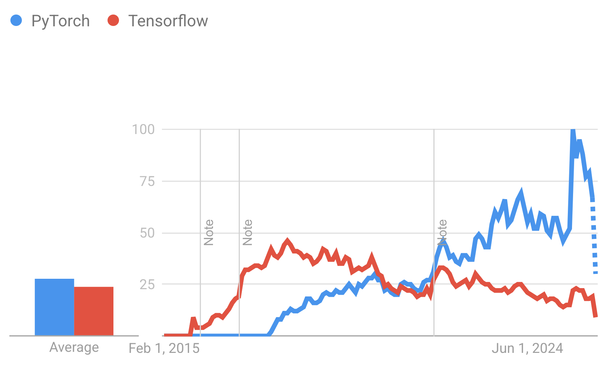

We'll be using PyTorch throughout the course, but you're free to experiment with other tools as well.

<details>

<summary>Have you used PyTorch before? What problems did it help you solve?</summary>

There is no right or wrong answer here. If you don't have experience, don't worry - we'll gain some here.

</details>

### Creating Tensors

<details>

<summary>What is a tensor?</summary>

Tensors are the equivalent to our class `Value` from the previous sessions. They are wrappers around floating-point numbers and (as you saw) are the building blocks of networks.

More generally, the tensor is a wrapper around an **n-dimensional NumPy array** with support for automatic backpropagation.

The mathematical interpretation of a tensor is very interesting. I suggest you [skim it in Wikipedia](https://en.wikipedia.org/wiki/Tensor) - here's a meme for it:

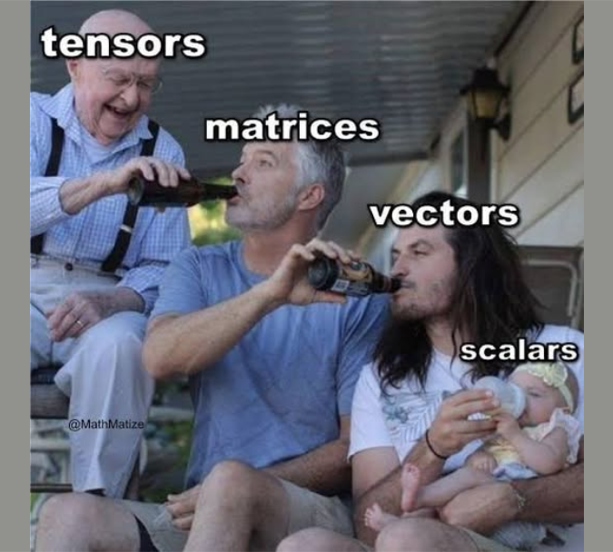

</details>

Here's how we can create tensors:

- from a Python list:

```python
import torch
xs = [[1, 2, 3], [4, 5, 6]]
tensor = torch.tensor(xs)
tensor
```

```console
tensor([[1, 2, 3],
        [4, 5, 6]])
```

```python
type(tensor)
```

```console
<class 'torch.Tensor'>
```

- from a NumPy array:

```python
import numpy as np
import torch
np_array = np.array([1, 2, 3])
np_tensor = torch.from_numpy(np_array)
np_tensor
```

```console
tensor([1, 2, 3])
```

- via `torch.tensor`:

```python
torch.tensor([[0.1, 1.2], [2.2, 3.1], [4.9, 5.2]])
```

```console
tensor([[ 0.1000,  1.2000],
        [ 2.2000,  3.1000],
        [ 4.9000,  5.2000]])
```

```python
torch.tensor([0, 1])  # Type inference on data
```

```console
tensor([ 0,  1])
```

```python
torch.tensor([[0.11111, 0.222222, 0.3333333]],
             dtype=torch.float64,
             device=torch.device('cuda:0'))  # creates a double tensor on a CUDA device
```

```console
tensor([[ 0.1111,  0.2222,  0.3333]], dtype=torch.float64, device='cuda:0')
```

```python
torch.tensor(3.14159)  # Create a zero-dimensional (scalar) tensor
```

```console
tensor(3.1416)
```

```python
torch.tensor([])  # Create an empty tensor (of size (0,))
```

```console
tensor([])
```

Interestingly enough if you open the documentation, you'll also see that we have a class `torch.Tensor`. So, when do we choose which?

- `torch.tensor` infers the data type automatically.
- `torch.Tensor` returns a `FloatTensor`.

My advice is that you stick to `torch.tensor`.

### Useful Attributes

PyTorch tensors are built on top of numpy, so the following is correct. What will it output?

```python
import torch
xs = [[1, 2, 3], [4, 5, 6]]
tensor = torch.tensor(xs)
tensor.shape, tensor.dtype
```

<details>

<summary>Reveal answer</summary>

```console
(torch.Size([2, 3]), torch.int64)
```

</details>

Deep learning often requires a GPU, which, compared to a CPU can offer:

- parallel computing capabilities;
- faster training times.

To see on which device the Tensor is currently sitting it, we can use the `.device` attribute:

```python
tensor.device
```

```console
device(type='cpu')
```

### Shapes matter

**Compatible:**

```python
a = torch.tensor([
    [1, 1],
    [2, 2],
])
b = torch.tensor([
    [2, 2],
    [3, 3],
])

a + b
```

```console
tensor([[3, 3],
        [5, 5]])
```

**Incompatible:**

```python
a = torch.tensor([
    [1, 1],
    [2, 2],
])
b = torch.tensor([
    [2, 2, 4],
    [3, 3, 4],
])

a + b
```

```console
Traceback (most recent call last):
  File "<stdin>", line 1, in <module>
RuntimeError: The size of tensor a (2) must match the size of tensor b (3) at non-singleton dimension 1
```

### Multiplication

<details>

<summary>What is broadcasting?</summary>

An implicit operation that copies an element (or a group of elements) `n` times along a dimension.

</details>

Element-wise multiplication can be done with the operator `*`:

```python
a = torch.tensor([
    [1, 1],
    [2, 2],
])
b = torch.tensor([
    [2, 2],
    [3, 3],
])

a * b
```

```console
tensor([[2, 2],
        [6, 6]])
```

We can do matrix multiplication with the function `torch.matmul`:

```python
# vector x vector
tensor1 = torch.randn(3)
tensor2 = torch.randn(3)
res = torch.matmul(tensor1, tensor2)
res, res.size()

# matrix x vector
tensor1 = torch.randn(3, 4)
tensor2 = torch.randn(4)
torch.matmul(tensor1, tensor2).size()

# batched matrix x broadcasted vector
tensor1 = torch.randn(10, 3, 4)
tensor2 = torch.randn(4)
torch.matmul(tensor1, tensor2).size()

# batched matrix x batched matrix
tensor1 = torch.randn(10, 3, 4)
tensor2 = torch.randn(10, 4, 5)
torch.matmul(tensor1, tensor2).size()

# batched matrix x broadcasted matrix
tensor1 = torch.randn(10, 3, 4)
tensor2 = torch.randn(4, 5)
torch.matmul(tensor1, tensor2).size()
```

```console
(tensor(0.7871), torch.Size([]))
torch.Size([3])
torch.Size([10, 3])
torch.Size([10, 3, 5])
torch.Size([10, 3, 5])
```

Check other built-in functions [in the documentation](https://docs.pytorch.org/docs/stable/torch.html).

### Our First Neural Network

We'll begin by building a basic, two-layer network with no hidden layers.

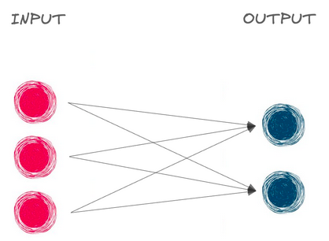

All functions and classes related to creating and managing neural networks can be explored in the [`torch.nn` module](https://pytorch.org/docs/stable/nn.html).

```python
import torch
import torch.nn as nn

linear_layer = nn.Linear(in_features=3, out_features=2)

user_data_tensor = torch.tensor([[0.3471, 0.4547, -0.2356]])
output = linear_layer(user_data_tensor)
output
```

```console
tensor([[-0.7252,  0.3228]], grad_fn=<AddmmBackward0>)
```

[Linear layer](https://pytorch.org/docs/stable/generated/torch.nn.Linear.html#linear):

- `in_features` (`int`) – size of each input sample;
- `out_features` (`int`) – size of each output sample;
- `bias` (`bool`) – If set to `False`, the layer will not learn an additive bias. Default: `True`.
- each linear layer has a `.weight` attribute:

```python
linear_layer.weight
```

```console
Parameter containing:
tensor([[-0.1971, -0.4996,  0.1233],
        [ 0.2203,  0.3508, -0.1402]], requires_grad=True)
```

- and a `.bias` attribute (by default):

```python
linear_layer.bias
```

```console
Parameter containing:
tensor([-0.4006,  0.0538], requires_grad=True)
```

For input $X$, weights $W_0$ and bias $b_0$, the linear layers performs:

$$y_0 = W_0 \cdot X + b_0$$

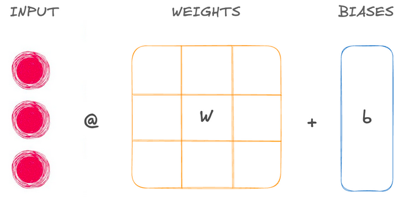

- in the example above, the linear layer is used to transform the output from shape $(1, 3)$ to shape $(1, 2)$. We refer to $1$ as the **batch size**: how many observations were passed at once to the neural network.
- networks with only linear layers are called **fully connected**: each neuron in a layer is connected to each neuron in the next layer.

### Stacking Layers With `nn.Sequential()`

We can easily compose multiple layers using the [`Sequential` class](https://pytorch.org/docs/stable/generated/torch.nn.Sequential.html#sequential):

```python
model = nn.Sequential(
    nn.Linear(10, 18),
    nn.Linear(18, 20),
    nn.Linear(20, 5),
)
model
```

```console
Sequential(
  (0): Linear(in_features=10, out_features=18, bias=True)
  (1): Linear(in_features=18, out_features=20, bias=True)
  (2): Linear(in_features=20, out_features=5, bias=True)
)
```

- Input is passed through the linear layers automatically.
- Here's how the sizes change: **Input 10** => output 18 => output 20 => **Output 5**.

```python
input_tensor
```

```console
tensor([[-0.0014,  0.4038,  1.0305,  0.7521,  0.7489, -0.3968,  0.0113, -1.3844,
          0.8705, -0.9743]])
```

```python
output_tensor = model(input_tensor)
output_tensor
```

```console
tensor([[-0.2361, -0.0336, -0.3614,  0.1190,  0.0112]],
       grad_fn=<AddmmBackward0>)
```

The output of this neural network:

- is still not yet meaningful. This is because the weights and biases are initially random floating-point values.
- is called a **logit**: non-normalized, raw network output.

What order should the following blocks be in, in order for the snippet to be correct:

1. `nn.Sequential(`
2. `nn.Linear(14, 3)`
3. `)`
4. `nn.Linear(3, 2)`
5. `nn.Linear(20, 14)`
6. `nn.Linear(5, 20)`

<details>

<summary>Reveal answer</summary>

1, 6, 5, 2, 4, 3

</details>

## Activation Functions

### Binary Classification

The sigmoid is also implemented as a layer - typically we use it as a last layer when performing binary classification:

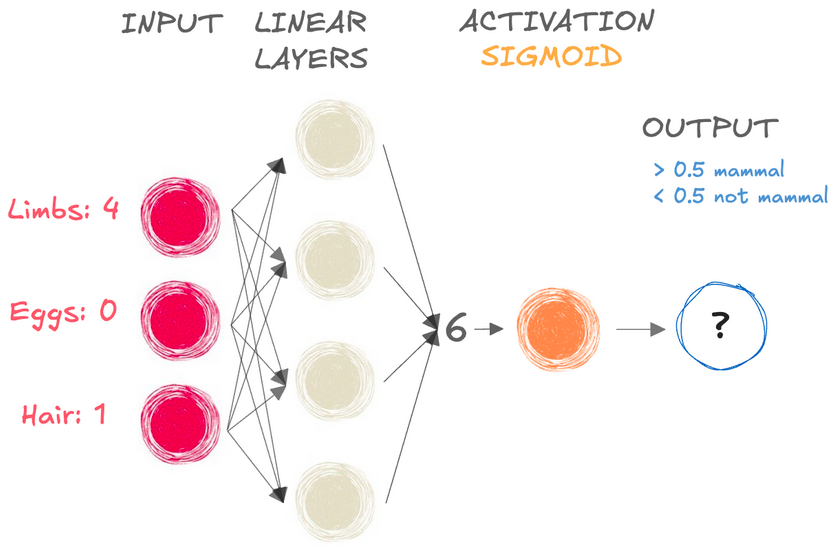

Remember that having the sigmoid as a last step in a network of stacked linear layers is equivalent to traditional logistic regression.

```python
model = nn.Sequential(
    nn.Linear(6, 4),
    nn.Linear(4, 1),
    nn.Sigmoid(),
)
```

Similarly, you can also use the [Hyperbolic Tangent](https://docs.pytorch.org/docs/stable/generated/torch.nn.Tanh.html).

### Multiclass Classification

When we're predicting more than two classes, we can use the function `Softmax`:

$$\text{Softmax}(x_{i}) = \frac{\exp(x_i)}{\sum_j \exp(x_j)}$$

It:

- Takes an `N`-element vector as input and outputs vector of same size.
- Outputs a probability distribution:
  - each element is a probability (it's bounded between `0` and `1`).
  - the sum of the output vector is equal to `1`.

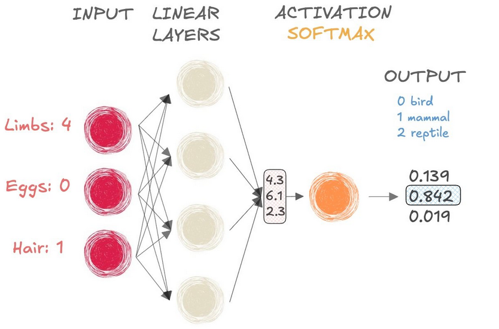

- `dim=-1` indicates softmax is applied to the input tensor's last dimension:

```python
input_tensor = torch.tensor([[4.3, 6.1, 2.3]])
softmax = nn.Softmax(dim=-1)
probabilities = softmax(input_tensor)
probabilities
```

```console
tensor([[0.1392, 0.8420, 0.0188]])
```

<details>

<summary>How do we call the values that get passed to the function/layer that returns probabilities?</summary>

Logits! Remember this term as it gets used quite often.

</details>

Which of the following statements about neural networks are true? (multiple selection)

```text
A. A neural network with a single linear layer followed by a sigmoid activation is similar to a logistic regression model.
B. A neural network can only contain two linear layers.
C. The softmax function is widely used for multi-class classification problems.
D. The input dimension of a linear layer must be equal to the output dimension of the previous layer.
```

<details>

<summary>Reveal answer</summary>

A, C, D.

</details>

### Fighting vanishing gradients

Let's recall the derivatives of the hyperbolic tangent and sigmoid:


<details>

<summary>What happens to the gradients for very high or very low input values?</summary>

They approach `0`!

</details>

<details>

<summary>Is this a good thing?</summary>

Nope! The far left (value $0$) and far right (value $1$) regions are known as **saturation regions** because the gradient/derivative there is too small, slowing down learning.

Because the weight upgrade of the network at each iteration is directly proportional to the gradient magnitude, we might get a network that seemingly learns very slowly.

- In other words, the sooner the learning starts to slow down, the less the first layers are going to learn. This is known as **the vanishing gradient problem**.

</details>

<details>

<summary>How can we deal with this problem?</summary>

We can use another activation function that does not saturate - we can pick from many examples:


</details>

One really popular option is the Rectified linear unit (ReLU):

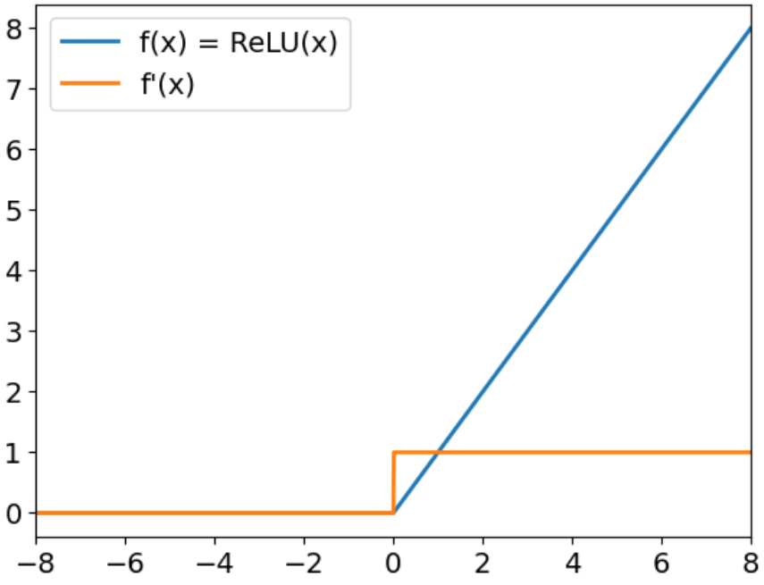

<details>

<summary>Looking at the graph, what is the function that ReLU applies?</summary>

$f(x) = max(x, 0)$

In PyTorch:

```python
relu = nn.ReLU()
```

</details>

<details>

<summary>What is the output for positive input?</summary>

The output is equal to the input.

</details>

<details>

<summary>What is the output for negative inputs?</summary>

$0$.

</details>

<details>

<summary>So, ReLU solves the vanishing gradient problem, right?</summary>

Because it has a deriviative value of $1$ for large positive values it does handle the left-hand side of the sigmoid/tanh graph.

Nevertheless, a large gradient flowing through could cause the bias to update in such a way that it becomes very negative, which in turn leads to the neuron outputting only negative values.

This would mean that the derivative will be $0$ and in the future the weights and bias will not be updated.

This is known as **the dying neuron problem** and acts like permanent brain damage.

Note:

- In practice, dead ReLUs connections are not a **major** issue.
- Most deep learning networks can still learn an adequate representations with only sub-selection of possible connections.
  - This is possible because deep learning networks are highly over-parameterized.
- The computational effectiveness and efficiency of ReLUs still make them one of the best options currently available (even with the possible drawbacks of dead neurons).

</details>

<details>

<summary>How can we solve this?</summary>

Well, we can pick another function that does not have a flat region, for example, the Leaky relu function:

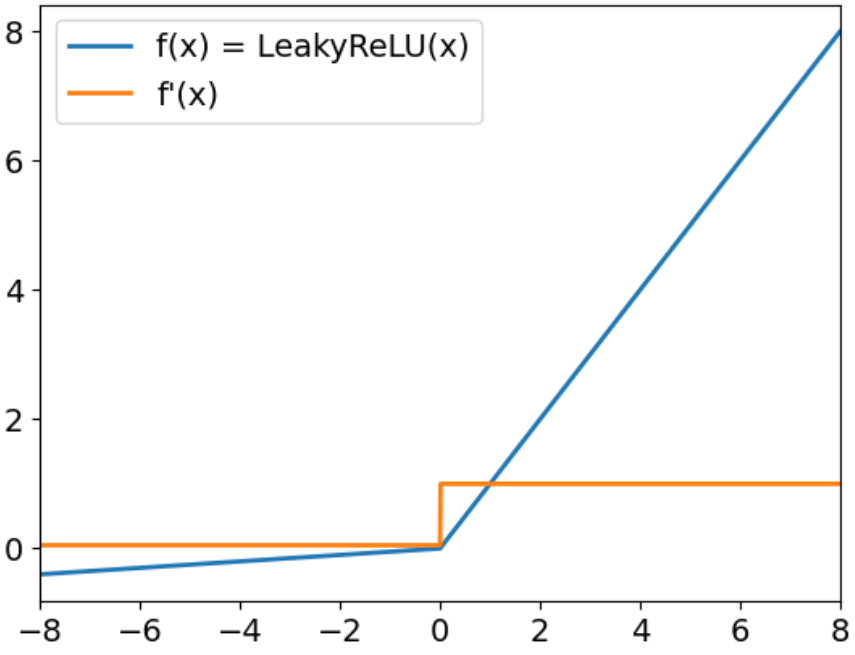

- Same behavior for positive inputs.
- Negative inputs get multiplied by a small coefficient: `negative_slope` (defaulted to $0.01$).
- The gradients for negative inputs are very small, but never $0$.
  - That still leaves the problem with the vanishing gradients.
    - We'll discuss another approach to fight it in the next session. For now it is important to understand that we'd like to preserve large activations as they signal that the model is recognizing a pattern.

In PyTorch:

```python
leaky_relu = nn.LeakyReLU(negative_slope=0.05)
```

</details>

## Loss Functions

<details>

<summary>What are the steps that occur during the so-called "forward pass"?</summary>

1. Input data is passed forward or propagated through a network.
2. Computations are performed at each layer.
3. Outputs of each layer are passed to each subsequent layer.
4. Output of the final layer is the prediction(s).

</details>

<details>

<summary>What are the steps that occur during the so-called "training loop"?</summary>

1. Forward pass.
2. Compare outputs to true values.
3. Backpropagate to update model weights and biases.
4. Repeat until weights and biases are tuned to produce useful outputs.

</details>

<details>

<summary>Wait - why was the loss function needed again?</summary>

It dictates how the weights and biases should be tweaked to more closely resemble the distribution of labels in the training dataset.

</details>

<details>

<summary>What loss function can we use for regressions problems?</summary>

The mean squared error loss:

$$MSE = \frac{1}{N} * \sum(y - \hat{y})^2$$

In PyTorch:

```python
criterion = nn.MSELoss()
loss = criterion(prediction, target)
print(loss.item())
```

</details>

Great!

Let's discuss now classification problems. Say that:

- $y$ is a single integer (class label), e.g. $y = 0$;
- $\hat{y}$ is a tensor (output of softmax), e.g. $[0.57492, 0.034961, 0.15669]$.

But there is a problem - we cannot compare an integer to a tensor.

<details>

<summary>How would we solve this?</summary>

We one-hot encode the integer/label:

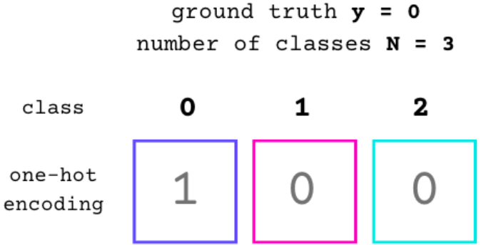

OHE in Pytorch:

```python
import torch.nn.functional as F
F.one_hot(torch.tensor(0), num_classes=3)
```

```console
tensor([1, 0, 0])
```

</details>

Perfect! Let's now show how can calculate the difference between those two tensors.

Our strategy when solving a classification problem is to **maximize the likelihood of observing our target values**. Let's see this strategy in the context of binary classification problems.

<details>

<summary>Do you know what the formal name of this process that finds such coefficients is?</summary>

[Maximum likelihood estimation](https://en.wikipedia.org/wiki/Maximum_likelihood_estimation)!

From Wikipedia:

"... a method of estimating the parameters of an assumed probability distribution, given some observed data. This is achieved by maximizing a likelihood function so that, under the assumed statistical model, the observed data is most probable."

</details>

Perfect - let's then see whether we have these ingredients.

<details>

<summary>Do we have observed data?</summary>

Yes, this is any dataset for classification purposes.

</details>

<details>

<summary>Do we know what our model is?</summary>

Yes, our computational graph represents it.

</details>

<details>

<summary>Do we know the probability distribution of our target variable?</summary>

In the context of a single observation, it follows the [Bernoulli distribution](https://en.wikipedia.org/wiki/Bernoulli_distribution) - the distribution for 0s and 1s:

$$y_i \sim Ber(\sigma(\text{our\_model}))$$

</details>

<details>

<summary>Ok, what was P(y = 1)?</summary>

$$P(y = 1) = \sigma(\text{our\_model}) = h_{\beta}(x)$$

</details>

<details>

<summary>What is P(y = 0)?</summary>

$$P(y = 0) = 1 - \sigma(\text{our\_model}) = 1 - h_{\beta}(x)$$

</details>

<details>

<summary>How can we combine the above two equations into one that can show us the probability for either of the two classes for a single observation?</summary>

$$P(y_i) = h_{\beta}(x_i)^{y_i} (1 - h_{\beta}(x_i))^{1 - y_i}$$

</details>

Awesome!

<details>

<summary>What is the general form of the likelihood function?</summary>

$$L(\beta) = P(Y | X; \beta)$$

where $Y$ are our target labels and $X$ are the inputs.

</details>

<details>

<summary>Knowing that Y has a Bernoulli distribution, how can we express the likelihood function?</summary>

Our ($m$) observations are (assumed to be) independent, so this probability is equal to the product of the individual probabilities:

$$L(\beta) = P(Y | X; \beta) = \prod_{i=1}^{m} P(y_i) = \prod_{i=1}^{m} h_{\beta}(x_i)^{y_i} (1 - h_{\beta}(x_i))^{1 - y_i}$$

</details>

<details>

<summary>We're dealing with products of probabilities here - what's a problem that can occur?</summary>

It wouldn't be numerically stable for very small numbers (which we'll get from all those multiplications).

</details>

<details>

<summary>How can we deal with this?</summary>

We can instead maximize the **log likelihood** to get a sum of probabilities:

$$L(\beta) = \sum_{i=1}^{m} \left( \log h_{\beta}(x_i)^{y_i} + \log (1 - h_{\beta}(x_i))^{1 - y_i} \right)$$

After moving the powers to become a multiplier, we get:

$$L(\beta) = \sum_{i=1}^{m} \left( {y_i} \log h_{\beta}(x_i) + (1 - y_i) \log (1 - h_{\beta}(x_i)) \right)$$

</details>

Ok, perfect! So, now we just have to maximize this function and we'll get our parameters $\beta$.

<details>

<summary>But wait a minute - last time we minimized a function (the loss function), why are we maximizing now?</summary>

That's a fair question! We needn't maximize, actually.

</details>

<details>

<summary>How can we still find the best parameters, but without maximizing?</summary>

We can **minimize** the **negative log likelihood** instead!

$$J(\beta) = - \sum_{i=1}^{m} \left( {y_i} \log h_{\beta}(x_i) + (1 - y_i) \log (1 - h_{\beta}(x_i)) \right)$$

Further more we can scale this function, like we did with linear regression and the **mean** squared error to get the average loss per observation:

$$J(\beta) = -\frac{1}{m} \sum_{i=1}^{m} \left( {y_i} \log h_{\beta}(x_i) + (1 - y_i) \log (1 - h_{\beta}(x_i)) \right)$$

</details>

And this right here that we derived is referred to as the **binary cross-entropy** (or **log loss**) **loss** function! It is a special case of [the cross-entropy function](https://en.wikipedia.org/wiki/Cross-entropy) in which $k = 2$:

$$L_{\log}(Y, \hat{P}) = -\log \operatorname{Pr}(Y|\hat{P}) = - \frac{1}{M} \sum_{i=0}^{M-1} \sum_{k=0}^{K-1} y_{i,k} \log \hat{p}_{i,k}$$

Great! Let's recap:

- Loss function for linear regression: $\frac{1}{m}\sum_{i=1}^{m}(y_i-\hat{y_i})^2$
- Loss function for logistic regression: $-\frac{1}{m} \sum_{i=1}^{m} \left( {y_i} \log h_{\beta}(x_i) + (1 - y_i) \log (1 - h_{\beta}(x_i)) \right)$

### Cross-entropy Loss in PyTorch

- Multiclass:

The PyTorch implementation has built-in softmax, so **it takes logits** and target classes.

```python
import torch
from torch.nn import CrossEntropyLoss

logits = torch.tensor([[-0.1211,  0.1059,  0.2142]])
one_hot_target = torch.tensor([[1., 0., 0.]])

criterion = CrossEntropyLoss()
criterion(logits, one_hot_target)
```

```console
tensor(1.2956)
```

- Binary classification using logits:

```python
import torch
from torch.nn import BCEWithLogitsLoss

logits = torch.tensor([[-0.1211,  0.1059]])
one_hot_target = torch.tensor([[1., 0.]])

criterion = BCEWithLogitsLoss()
criterion(logits, one_hot_target)
```

```console
tensor(0.7515)
```

- Binary classification using probabilities:

```python
import torch
from torch import nn

m = nn.Sigmoid()
criterion = nn.BCELoss()
inputs = torch.randn(3, 2)
target = torch.rand(3, 2)
criterion(m(inputs), target)
```

```console
tensor(0.8442)
```

### Backpropagation

Consider a network made of three layers, $L0$, $L1$ and $L2$:

- we calculate local gradients for $L0$, $L1$ and $L2$ using backpropagation;
- we calculate loss gradients with respect to $L2$, then use $L2$ gradients to calculate $L1$ gradients and so on.

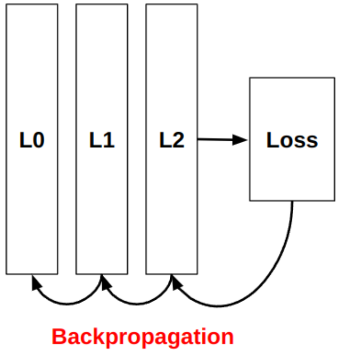

PyTorch does automatic backpropagation:

```python
criterion = CrossEntropyLoss()
loss = criterion(prediction, target)
loss.backward() # compute every gradient automatically
```

If we wanted to see the gradients, we can:

```python
print(model[0].weight.grad, model[0].bias.grad)
print(model[1].weight.grad, model[1].bias.grad)
print(model[2].weight.grad, model[2].bias.grad)
```

We can then update the model parameters using a particular strategy (or optimizer).

Here's how we can do it manually using the strategy of the Stochastic Gradient Descent optimizer:

```python
lr = 0.001

weight = model[0].weight
weight_grad = model[0].weight.grad
weight = weight - lr * weight_grad

bias = model[0].bias
bias_grad = model[0].bias.grad
bias = bias - lr * bias_grad
```

## Optimizers

<details>

<summary>What is an optimizer?</summary>

The functionality that performs parameter updates.

</details>

Different optimizers have different logic for updating model parameters. Some built-in optimizers include:

- [Stochastic gradient descent (SGD)](https://docs.pytorch.org/docs/stable/generated/torch.optim.SGD.html), optionally with momentum;
- [AdaGrad](https://docs.pytorch.org/docs/stable/generated/torch.optim.Adagrad.html);
- [RMSProp](https://docs.pytorch.org/docs/stable/generated/torch.optim.RMSprop.html);
- [Adam](https://docs.pytorch.org/docs/stable/generated/torch.optim.Adam.html);
- [AdamW](https://docs.pytorch.org/docs/stable/generated/torch.optim.AdamW.html) <- **most popular**.

### Stochastic gradient descent

<details>

<summary>In which part of the model creation are optimizers used?</summary>

They are used inside the training loop, all in the same manner:

```python
from torch import 

optimizer = optim.SGD(model.parameters(), lr=0.001)

<... start trainig loop ...>

optimizer.zero_grad() # make the current gradients 0
loss.backward()       # calculate the new gradients
optimizer.step()      # update the parameters

<... end trainig loop ...>
```

</details>

<details>

<summary>What was the formula for the plain SGD we discussed last time?</summary>

$$w_{\text{new}} = w_{\text{old}} - \eta \text{grad}$$

where $\eta$ is the learning rate.

</details>

### Stochastic gradient descent with momentum

<details>

<summary>What is the main problem of SGD?</summary>

It tends to get stuck at local minima.

</details>

SGD with momentum adds a velocity jump to prevent this:

$$v_{t+1} = \rho v_t - \eta \text{grad} \\
w_{\text{new}} = w_{\text{old}} + v_{t+1}$$

Notice how the momentum ($\rho$) decreases the value of the update. Thus, $\rho$ is another hyperparameter alongside $\eta$.

But what about $v_t$ - we can see that it's used as an accumulator but what is its initial value? Open the documentation of `SGD` in PyTorch (link above) and check it out.

<details>

<summary>What is the initial value of "v"?</summary>

We're concerned with the part here:

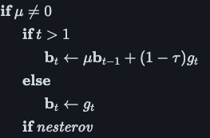

- $b_t$ is our $v_{t+1}$;
- $\mu$ is our $\rho$;
- $g_t$ is our current gradient, i.e. $\text{grad}$;
- we won't be dealing with dampening ($\tau$) so we can ignore it (it's $0$ by default anyways);

Importantly, $t$ is our timestep, hence initially $t=0$ and therefore $b_0 = v_0 = {\text{grad}}$.

</details>

### AdaGrad

The following methods attempt to adaptively scale the gradient step instead of decreasing it with an additional variable.

AdaGrad scales the gradient step by diving it by the square root of the sum of the squared accumulated gradient so far:

$$w_{i, t + 1} = w_{i,t} - \frac{\eta}{\epsilon + \sqrt{\Sigma_{j=1}^t \text{grad}(w_{i,t})^2}} \text{grad}(w_{i,t})$$

When we implement this, instead of calculating $\Sigma_{j=1}^t \text{grad}(w_{i,t})^2$ at every iteration, we will store it as a variable and just add (i.e. accumulate) the square of the current gradient to it:

$$v_{t+1} = v_t + \text{grad}^2 \\
w_{\text{new}} = w_{\text{old}} - \frac{\eta}{\epsilon + \sqrt{v_{t+1}}} \text{grad}$$

### RMSprop

<details>

<summary>Looking at the update equation what would say would be the main drawback of AdaGrad?</summary>

Its main weakness is that **it can only *decrease* the learning rate**, thus it is possible that it "overdecays" it.

</details>

Root Mean Square propagation (RMSprop) attempts to circumvent this issue. It extends the above equation for accumulating the gradient with an additional parameter $\alpha$.

<details>

<summary>Can you intuit what the equation looks like for RMSProp?</summary>

$$v_{t+1} = \alpha v_t + (1 - \alpha) \text{grad}^2 \\
w_{\text{new}} = w_{\text{old}} - \frac{\eta}{\epsilon + \sqrt{v_{t+1}}} \text{grad}$$

This allows the learning rate to both increase and decrease. You can think of $\alpha$ as a "discount" parameter that controls how much of the previous gradient is remembered.

- The higher $\alpha$ is, the **slower** the learning rate would increase if there is a small gradient (long memory, slow adaptation).
- The lower $\alpha$ is, the **faster** the learning rate would increase if there is a small gradient (short memory, fast adaptation).

> **Note:** Typically, $0 <= \alpha <= 1$.

</details>

<details>

<summary>What is the default value of alpha in PyTorch?</summary>

$0.99$

</details>

<details>

<summary>Can you think of an example in which the learning rate will be increased?</summary>

Let's say:

- $\eta = 0.01$
- $\alpha = 0.9$

So, now if we have:

- $\text{grad} = 0.02$, small gradient incoming
- $v_{t-1} = 0.4$, the higher this is, the more the learning rate will be increased (it'll also be increased even if it was $0.01$ albeit it'd be increased very slowly).

The effective learning rate before the update would be:

$$\frac{\eta}{\epsilon + \sqrt{v_{t+1}}} = \frac{0.01}{\sqrt{0.4}} \approx 0.0158$$

The effective learning rate after the update would be:

$$v_t = 0.9(0.4) + 0.1(0.02^2) = 0.36 + 0.00004 = 0.36004 \\
\frac{\eta}{\epsilon + \sqrt{v_{t+1}}} = \frac{0.01}{\sqrt{0.36004}} \approx 0.0166$$

If gradients remain small for several steps, $v_t$ will keep shrinking:

Next step:

$$v_{t+1} = 0.9(0.36004) + 0.1(0.02^2) \approx 0.324$$

Effective LR:

$$\frac{\eta}{\epsilon + \sqrt{v_{t+1}}} = \frac{0.01}{\sqrt{0.324}} \approx 0.0176$$

</details>

You can play out the above example for a larger $\text{grad}$ to see the decrease in the learning rate.

### Adam

<details>

<summary>Hmm - but what is the logic behind this decrease of the learning rate when the gradient is big - shouldn't we make larger steps then?</summary>

When the gradient is big it is assumed that if we have a high learning rate, we'll overshoot our target. Thus, the algorithm makes small steps in an attempt to land exactly at the minimum of the function.

</details>

<details>

<summary>But what problem would this lead to?</summary>

We can get stuck at local minima. This is because the algorithm assumes that `large gradient = global minimum incoming`, but this might not be the case.

</details>

<details>

<summary>Which previous algorithm helped us to pass local minima?</summary>

SGD with momentum!

</details>

Great! Well, what does that mean? If we combined the properties of RMSprop and the properties of SGD, we'd get an algorithm that can dynamically choose a learning rate, while also being resistant to local minima.

This is exactly what the Adaptive moment estimation (Adam) algorithm does!

It keeps the idea of RMSprop for dynamic increase/decrease of the learning rate and it refers to it as the **second momentum** (as it is based on the squared gradient):

$$v_{t+1} = \beta_2 v_t + (1 - \beta_2) \text{grad}^2$$

And it also measures and uses the **first momentum** that mirrors SGD with momentum:

$$m_{t+1} = \beta_1 m_t + (1 - \beta_1) \text{grad}$$

Recall the "classical momentum": $v_{t+1} = \rho v_t - \eta \text{grad}$.

By default in PyTorch:

- $\eta = 0.001$
- $\beta_1 = 0.9$
- $\beta_2 = 0.999$
- $\epsilon = 10^{-8}$

Note that the vectors $m$ and $v$ are initialized to be only zeros. That means that the estimates $m_{t+1}$ and $v_{t+1}$ will be "unfairly" low during the early epochs (as $\beta_2 v_t$ and $\beta_1 m_t$ will be $0$) and stabilize over time. To address this initialization bias, Adam applies bias correction:

$$\hat{m}_{t+1} = \frac{m_{t+1}}{1 - \beta_1^{t+1}}$$

$$\hat{v}_{t+1} = \frac{v_{t+1}}{1 - \beta_2^{t+1}}$$

Thus, the final formula for the update of the weights is:

$$w_{\text{new}} = w_{\text{old}} - \frac{\eta}{\epsilon + \sqrt{\hat{v}_{t+1}}} \hat{m}_{t+1}$$

### AdamW

<details>

<summary>What do you know about weight decay?</summary>

Weight decay adds `L2` penalty to the loss function to discourage large weights and biases. This is done by increasing the gradient with a `weight_decay` fraction of the weights:

$$Loss = Error(Y - \widehat{Y}) +  \lambda \sum_1^n w_i^{2}$$

```python
d_p = p.grad.data
if weight_decay != 0:
    d_p.add_(weight_decay, p.data)
```

The optimizers we discussed all have this parameter:

```python
optimizer = optim.SGD(model.parameters(), lr=1e-3, weight_decay=1e-4)
```

- The `weight_decay` parameter takes values between `0` and `1`, typically small ones, e.g. `1e-3`.
  - It's goal is to shink the parameters to `0` as large parameters tend to signal overfitting (we'll discuss this shortly).
- The higher the decay, the stronger the regularization, thus the less likely the model is to overgit.

</details>

Adam applies L2 weight decay by mixing it into the gradient update, which makes the decay behave like adaptive L2 regularization.

AdamW decouples the weight decay from the gradient update, applying it as a separate step that produces more stable regularization, especially for large models.

The main difference is how $\text{grad}$ is calculated:

- In Adam we have: $\text{grad} = \text{grad} + 2 \lambda w_{\text{old}}$ and this is calculated before we enter the above equations.
- In AdamW we do not add anything to initial gradient/derivative. Instead, we add the penalty when doing the step:

$$w_{\text{new}} = w_{\text{old}} - \eta \lambda w_{\text{old}} - \frac{\eta}{\epsilon + \sqrt{\hat{v}_{t+1}}} \hat{m}_{t+1}$$

Throught the course, we'll use the AdamW optimizer.

## Metrics

Great - let's now connect these tools into a process!

<details>

<summary>List the steps that would be used to train a neural network.</summary>

1. Create a dataset.
2. Create a model.
3. Define a loss function.
4. Define an optimizer.
5. Run a training loop, where for each batch of samples in the dataset, we repeat:
   1. Zeroing the graidents.
   2. Forward pass to get predictions for the current training batch.
   3. Calculating the loss.
   4. Calculating gradients.
   5. Updating model parameters.

</details>

PyTorch provides us with two classes that we can use for working with datasets:

- `TensorDataset`: acts as a wrapper around our features and targets.
- `DataLoader`: splits the dataset into batches.

```python
dataset = TensorDataset(torch.tensor(features).float(), torch.tensor(target).float()) # has to be the same datatype as the parameters of the model
input_sample, label_sample = dataset[0]
print(input_sample)
print(label_sample)

dataloader = DataLoader(dataset, batch_size=4, shuffle=True)
for batch_inputs, batch_labels in dataloader:
    print(f'{batch_inputs=}')
    print(f'{batch_labels=}')
```

An example of a dataset we'll be playing around with is The water potability dataset:

- Task: classify a water sample as potable or drinkable (`1` or `0`) based on its chemical characteristics.
- All features have been normalized to between zero and one. Two files are present in our `DATA` folder: `water_train.csv` and `water_test.csv`. Here's how both of them look like:

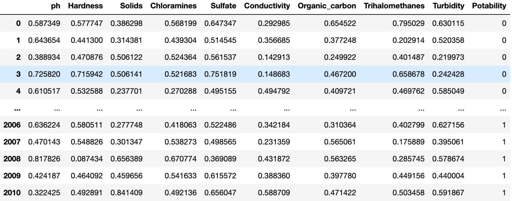

Ok - great! We have a concrete dataset. Let's elaborate more on point `5` ("Run a training loop, where for each batch of samples in the dataset, we repeat").

<details>

<summary>Which dataset are we talking about?</summary>

When training neural networks in a supervised fashion we typically break down all the labeled data we have into three sets:

| Name       | Percent of data | Description                                                                                                 |
| ---------- | --------------- | ----------------------------------------------------------------------------------------------------------- |
| Train      | 70-90           | Learn optimal values for model parameters                                                                   |
| Validation | 5-15            | Hyperparameter tuning (batch size, learning rate, number of layers, number of neurons, type of layers, etc) |
| Test       | 5-15            | Only used once to calculate final performance metrics                                                       |

</details>

<details>

<summary>What classification metrics have you heard of?</summary>

- Accuracy: percentage of correctly classified examples.
- Recall: from all true examples, what percentage did our model find.
- Precision: from all the examples are model labelled as true, what percentage of the examples are actually true.
- F1: harmonic mean of precision and recall.

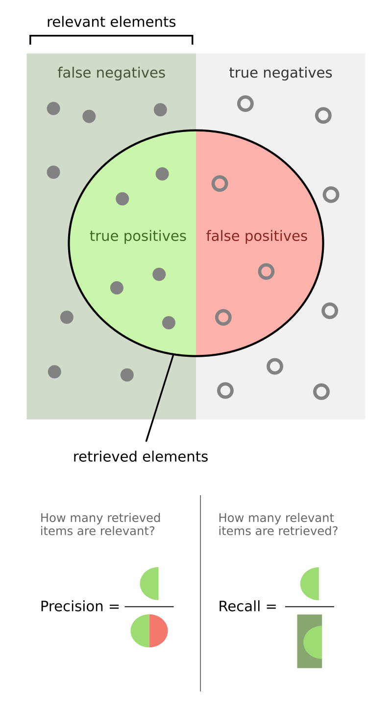

<details>

<summary>When should we use accuracy?</summary>

Only when all of the classes are perfectly balanced.

</details>

<details>

<summary>What metic should we use when we have an unbalanced target label?</summary>

F1-score.

</details>

</details>

The package [`torchmetrics`](https://lightning.ai/docs/torchmetrics/stable//index.html) provides implementations of popular classification and regression metrics:

- [accuracy](https://lightning.ai/docs/torchmetrics/stable/classification/accuracy.html#id4).
- [recall](https://lightning.ai/docs/torchmetrics/stable/classification/recall.html#id4).
- [precision](https://lightning.ai/docs/torchmetrics/stable/classification/precision.html#id4).
- [f1-score](https://lightning.ai/docs/torchmetrics/stable/classification/f1_score.html#f-1-score).
- [mean squared error](https://lightning.ai/docs/torchmetrics/stable/regression/mean_squared_error.html#mean-squared-error-mse).

Here's how we can use them:

```python
import torchmetrics

metric = torchmetrics.Accuracy(task='multiclass', num_classes=3)
for samples, labels in dataloader:
    outputs = model(samples)
    acc = metric(outputs, labels.argmax(dim=-1))
acc = metric.compute()
print(f'Accuracy on all data: {acc}')
metric.reset()
```

### Calculating validation loss

After each training epoch we iterate over the validation set and calculate the average validation loss.

It's important to put the model in an evaluation mode, so no gradients get calculated and all layers are used as if they were processing user data.

```python
validation_loss = 0.0
model.eval()
with torch.no_grad():
    for sample, label in validation_loader:
        model(sample)
        loss = criterion(outputs, labels)
        validation_loss += loss.item()
epoch_validation_loss = validation_loss / len(validation_loader)
model.train()
```

### The Bias-Variance Tradeoff

<details>

<summary>What have you heard about it?</summary>

It can be used to determine whether a model has reached its best capabilities, is underfitting or is overfitting.

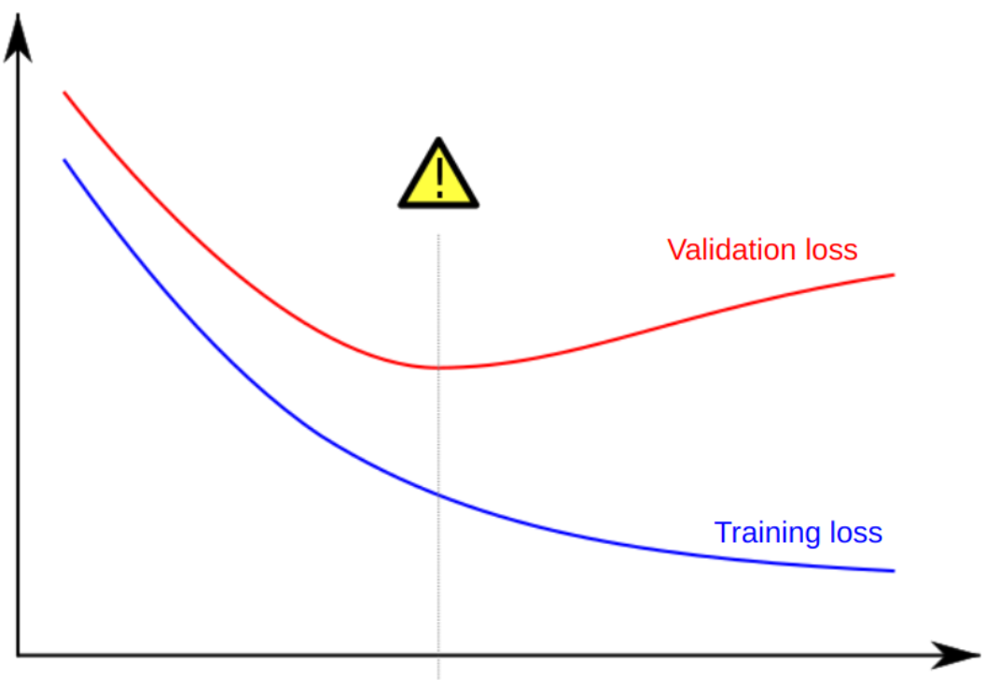

<details>

<summary>What is underfitting?</summary>

High training loss and high validation loss.

</details>

<details>

<summary>What is overfitting?</summary>

Low training loss and high validation loss.

</details>

</details>

## How to count model parameters

### Layer naming conventions

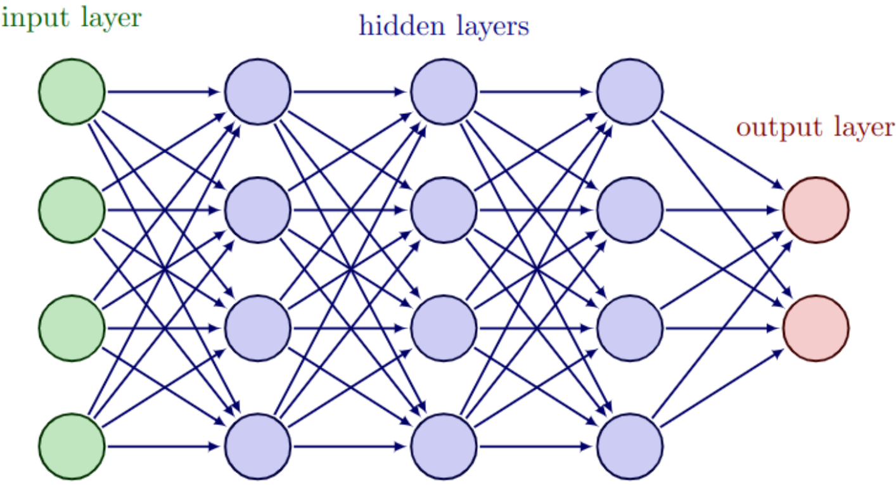

<details>

<summary>What is the dependency between the number of neurons in the input layer and the user data?</summary>

The number of neurons in the input layer depends on the number of features in a single observation.

</details>

<details>

<summary>What is the dependency between the number of neurons in the output layer and the user data?</summary>

The number of neurons in the output layer depends on the number of classes that can be assigned.

<details>

<summary>What if it's a regression problem?</summary>

Then the output layer is a single neuron.

So, we get the following architecture:

```python
model = nn.Sequential(nn.Linear(n_features, 8),
                      nn.Linear(8, 4),
                      nn.Linear(4, n_classes))
```

</details>

</details>

### PyTorch's `numel` method

- We could vary the number of neurons in the hidden layers (and the amount of hidden layers).
- However, we should remember that increasing the number of hidden layers = increasing the number of parameters = increasing the **model capacity**.

Given the following model:

```python
n_features = 8
n_classes = 2

model = nn.Sequential(nn.Linear(n_features, 4),
                      nn.Linear(4, n_classes))
```

We can manually count the number of parameters:

- first layer has $4$ neurons, each connected to the $8$ neurons in the input layer and $1$ bias $= 36$ parameters.
- second layer has $2$ neurons, each connected to the $4$ neurons in the input layer and $1$ bias $= 10$ parameters.
- Total: $46$ learnable parameters.

In PyTorch, we can use the `numel` method to get the number of parameters of a neuron:

```python
total = 0
for parameter in model.parameters():
    total += parameter.numel()
print(total)
```

Calculate manually the number of parameters of the model below. How many does it have?

```python
model = nn.Sequential(nn.Linear(16, 4),
                      nn.Linear(4, 2),
                      nn.Linear(2, 1))
```

<details>

<summary>Reveal answer</summary>

$81$.

We can confirm it:

```python
model = nn.Sequential(nn.Linear(16, 4),
                      nn.Linear(4, 2),
                      nn.Linear(2, 1))

print(sum(param.numel() for param in model.parameters()))
```

</details>

## Tips For Training Neural Networks

### Fighting overfitting

<details>

<summary>What is the result of overfitting?</summary>

The model does not generalize to unseen data.

</details>

<details>

<summary>What are the causes of overfitting?</summary>

| Problem                     | Solution                              |
| --------------------------- | ------------------------------------- |
| Model has too much capacity | Reduce model size / Add dropout       |
| Weights are too large       | Use weight decay                      |
| Dataset is not large enough | Get more data / Use data augmentation |

</details>

### Using a [`Dropout` layer](https://pytorch.org/docs/stable/generated/torch.nn.Dropout.html#dropout)

- During training, randomly zeroes some of the elements of the input tensor with probability `p`.
  - This would mean that the neuron did not "fire" / did not get triggered.
- Add after the activation function.
- Behaves differently during training and evaluation/prediction:
  - we must remember to switch modes using `model.train()` and `model.eval()`.

```python
nn.Sequential(
    nn.Linear(n_features, n_classes),
    nn.ReLU(),
    nn.Dropout(p=0.8))
```

We can try it out:

```python
import numpy as np
import torch
from torch import nn

m = nn.Dropout(p=0.2)

inp = torch.randn(20, 16)
(m(inp).view(-1).numpy() == 0).mean()
```

```console
np.float64(0.1925)
```

### Data augmentation

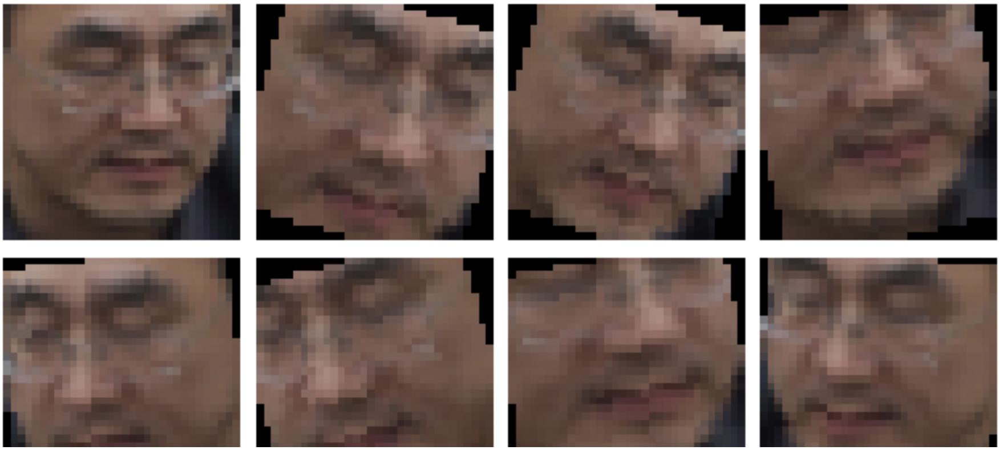

- End result: Increased size and diversity of the training set.
- We'll discuss different pros and cons of this strategy in the upcoming weeks.

### Steps to maximize model performance

1. Overfit the training set (rarely possible to a full extend).
   - We ensure that the problem is solvable using deep learning.
   - We set a baseline to aim for with the validation set.
2. Reduce overfitting.
   - Improve performance on the validation set.
3. Fine-tune hyperparameters.

#### Step 1: overfit the training set

If this is not possible to do with the full training set due to memory constraints, modify the training loop to overfit a `batch_size` of points (`batch_size=1` is also a possibility).

```python
features, labels = next(iter(trainloader))
for i in range(1e3):
    outputs = model(features)
    loss = criterion(outputs, labels)
    loss.backward()
    optimizer.step()
```

- Should reach accuracy (or your choice of metric) `1.0` and loss close (or equal) to `0.0`.
- This also helps with finding bugs in the code or in the data.
- Use the default value for the learning rate.
- Deliverables:
    1. Large enough model.
    2. Minimum training loss.

#### Step 2: reduce overfitting

- Start to keep track of:
  - training loss;
  - training metric values;
  - validation loss;
  - validation metric values.
- Experiment with:
  - Dropout;
  - Data augmentation;
  - Weight decay;
  - Reducing the model capacity.
- Keep track of each hyperparamter.
- Deliverables:
  1. Maximum metric value on the validation set.
  2. Minimum loss on the validation set.
  3. Plots validating model performance.

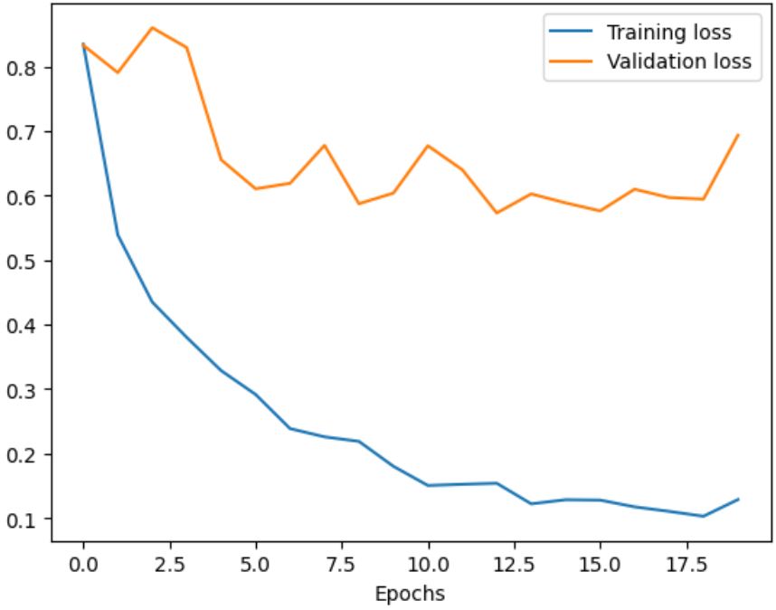

Be careful to not increase the training loss and reduce the training metric by too much (overfitting-reduction strategies often lead to this):

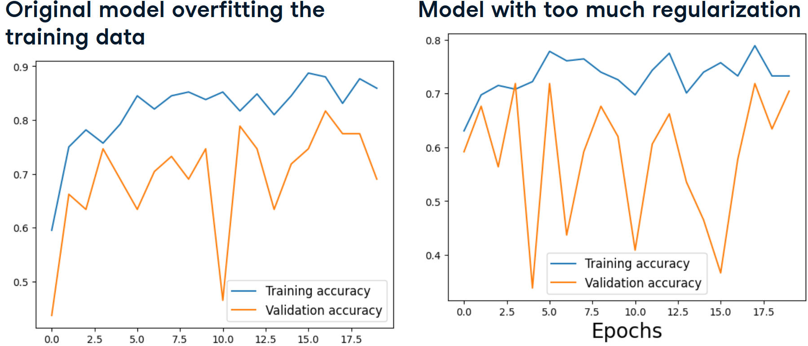

#### Step 3: fine-tune hyperparameters

Grid search:

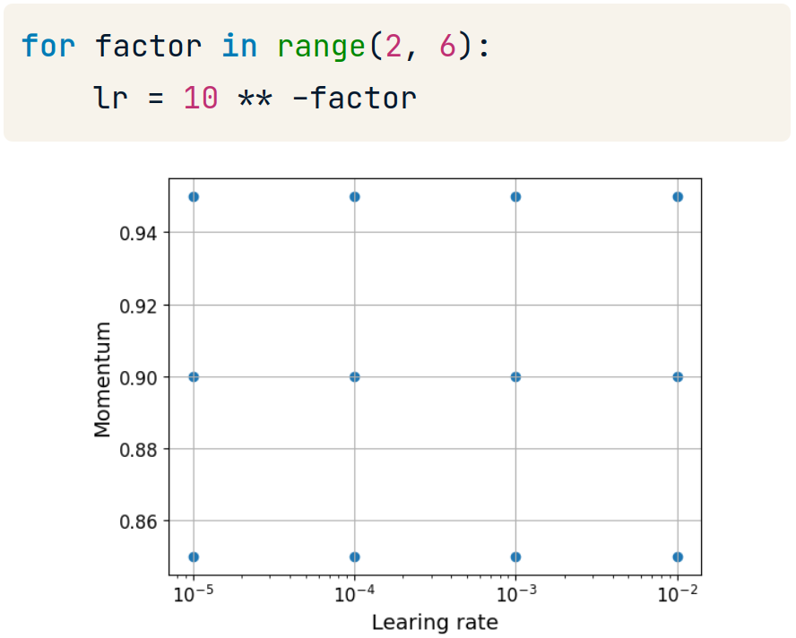

Random search:

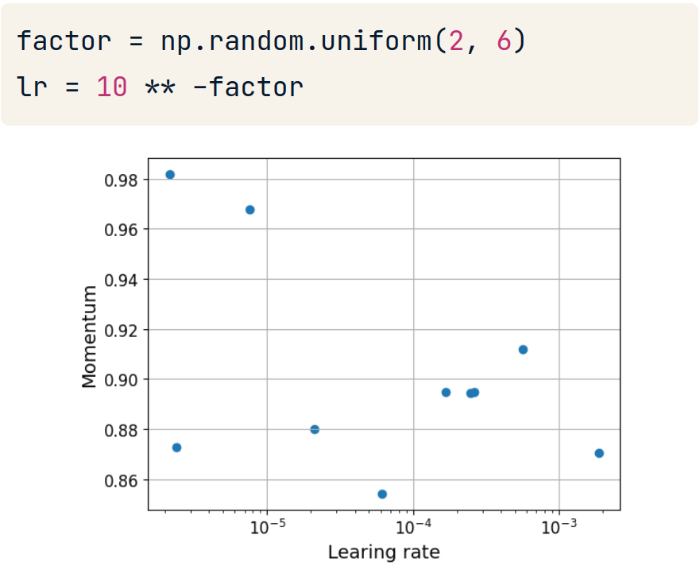

- for the initialization part:

Instead of writing this:

```python
import torch.nn as nn
layer = nn.Linear(64, 128)
print(layer.weight.min(), layer.weight.max())
```

```console
tensor(-0.1250, grad_fn=<MinBackward1>) tensor(0.1250, grad_fn=<MaxBackward1>)
```

We can write this:

```python
import torch.nn as nn
layer = nn.Linear(64, 128)
nn.init.uniform_(layer.weight)
print(layer.weight.min(), layer.weight.max())
```

```console
tensor(3.0339e-05, grad_fn=<MinBackward1>) tensor(1.0000, grad_fn=<MaxBackward1>)
```

## The Model Report File

Whenever we're building a model, we're going to have to produce the so-called **Model report**. This is an Excel file, but serves as the basis of our work and tells the story of our journey. It is typically **presented to your clients** and shows what has been tried out, what worked, what didn't and, ultimately, which is the best model for the task.

Here're the guidelines we'll follow:

1. Each row is a hypothesis - a model that was trained and evaluated.
2. The columns are divided into two sets: the first set of columns represent the values of the hyperparameters of the model, the second set: the metrics on the **test** set. Do not use more than `3` metrics.
3. The first row holds the so-called **baseline model**. This model can be only one of two things: if currently there is a deployed model on the client's environment, then it is taken to be the baseline model. Otherwise the baseline model is the greediest statistical model. For example, this is the model that predicts the most common class in classification problems.
4. The columns that show the metrics express both the value of the metric as well as the percentage of change **compared to the *baseline* model** (we're striving for percentage increase, but should report every case).
5. The rightmost column should be titled `Comments` and should hold our interpretation of the model (what do we see as metrics, is it good, is it bad, etc). We may include the so-called `Error Analysis` which details where this model makes mistakes.
6. Above or below the main table there should be a cell that **explicitly** states which is the best model and why.
7. Below the table or in other sheets there should be the following diagrams: `train vs validation metric` (the main metric used) and if the model outputs a loss, we should have a `train vs validation loss` diagram.
8. The table should not be a pandas export - it should be coloured and tell the story of modelling. Bold and/or highlight the entries in which the metric is highest or to which you want to draw attention to.
9. Do not sort the table after completing the experiments - it should be in the order of the created models. This lets you build up on the section `Comments` and easily track the changes made.
10. Do not create a very wide table - it **should be easy to understand which is the best model** in one to two seconds of looking at it. Focus on the user experience.
11. Optionally, you could create an additional sheet for the best model in which you put 4-5 examples of correct and incorrect predictions. This will control the client's expectations.

> **Tip**: Since we're talking about doing a lot of experiments (typically `50` - `200`), you'll find it tedious to use Jupyter notebooks. Instead, create **scripts** and run them **in parallel**. This will speed up modelling speed tremendously!

The end result is a table that is present in most scientific papers. Here are some examples:

- [EXAMS-V: A Multi-Discipline Multilingual Multimodal Exam Benchmark for Evaluating Vision Language Models](https://arxiv.org/pdf/2403.10378)


- [ImageNet Classification with Deep Convolutional Neural Networks](https://proceedings.neurips.cc/paper_files/paper/2012/file/c399862d3b9d6b76c8436e924a68c45b-Paper.pdf)


- [BERT: Pre-training of Deep Bidirectional Transformers for Language Understanding](https://arxiv.org/pdf/1810.04805)


# Week 04 - Convolutional Neural Networks. Building multi-input and multi-output models

## Custom Datasets in PyTorch

Last session we showed how we can use the class `data.TensorDataset` to create tensors out of features and targets. This is great when we don't have any preprocessing logic and/or when the raw data type is numeric.

In this session we'll work with images and they cannot be directly read as a `TensorDataset` object. We'll have to create a custom `Dataset` class to load (and, optionally, preprocess) them. However, these classes are not just limited to images. We can create a custom dataset for our water potability data as well by inheriting the PyTorch [Dataset class](https://pytorch.org/docs/stable/data.html#torch.utils.data.Dataset). All customs `Dataset` classes must implement the following methods:

- `__init__`: to load and save the data in the state of the class. We can accept any parameters that allow us to load the data, for example, a path to a CSV file or a folder with images, or an already loaded `numpy` matrix;
- `__len__`: returns the number of instances in the saved data;
- `__getitem__`: returns the features and label for a single sample. Note: this method returns **a tuple**! The first element is an array of the features, the second is the label.

See an example [in the documentation of PyTorch](https://pytorch.org/tutorials/beginner/basics/data_tutorial.html#creating-a-custom-dataset-for-your-files).

> **Note:** While it's not shown in the example, please don't forget to initialize the parent class as well by calling `super().__init__()`.

What is the correct way of iterating through the dataloader and passing the inputs to the model?

```text
A. for img, alpha, labels in dataloader_train: outputs = net(img, alpha)
B. for img, alpha, labels in dataloader_train: outputs = net(img)
C. for img, alpha in dataloader_train: outputs = net(img, alpha)
D. for img, alpha in dataloader_train: outputs = net(img)
```

<details>
<summary>Reveal answer</summary>

A.

</details>

## Class-Based PyTorch Model

In the previous session we used `nn.Sequential` to create models. It a functional style that provides a really fast way to create deep neural networks, but it takes away the control we have over how data flows from one layer to the next.

<details>
<summary>What is the main assumption of the functional style model creation in PyTorch?</summary>

It is that the data flows in a linear fashion without intermediate transformations. It is really just a chain of classes that get executed in the particular order.

</details>

To alleviate this, we'll use another syntax to define models: the `class-based` approach.

Here's an example of sequential model definition:

```python
import torch.nn as nn

net = nn.Sequential(
  nn.Linear(9, 16),
  nn.ReLU(),
  nn.Linear(16, 8),
  nn.ReLU(),
  nn.Linear(8, 1),
  nn.Sigmoid(),
)
```

Here's how it can be re-written using the `class-based` approach:

```python
class Net(nn.Module):
  def __init__(self):
    super(Net, self).__init__()
    self.fc1 = nn.Linear(9, 16)
    self.fc2 = nn.Linear(16, 8)
    self.fc3 = nn.Linear(8, 1)
  
  def forward(self, x):
    x = nn.functional.relu(self.fc1(x))
    x = nn.functional.relu(self.fc2(x))
    x = nn.functional.sigmoid(self.fc3(x))
    return x

net = Net()
```

As can be seen above, every model should define the following two methods:

- `__init__()`: defines the layers that are used in the `forward()` method;
- `forward()`: defines what happens to the model inputs once it receives them; this is where you pass inputs through pre-defined layers.

By convention `torch.nn.functional` gets imported with an alias `F`. That means that the above body of `forward` can be rewritten like:

```python
import torch.nn.functional as F

...

x = F.relu(self.fc1(x))
x = F.relu(self.fc2(x))
x = F.sigmoid(self.fc3(x))
```

## Working with images in PyTorch

### The Clouds dataset

We will be working with a dataset containing pictures of various types of clouds.


<details>

<summary>How can we load one of those images in Python?</summary>

We can use the [`pillow`](https://pypi.org/project/pillow/) package. It is imported with the name `PIL` and has a very handly [`Image.open` function](https://pillow.readthedocs.io/en/latest/handbook/tutorial.html#using-the-image-class).

</details>

<details>

<summary>Wait - what is an image again?</summary>

- The image is a matrix of pixels ("picture elements").
- Each pixel contains color information.


- Grayscale images: integer in the range $[0 - 255]$.
  - 30:

    

- Color images: three/four integers, one for each color channel (**R**ed, **G**reen, **B**lue, sometimes also **A**lpha).
  - RGB = $(52, 171, 235)$:

    

</details>

### Converting pixels to tensors and tensors to pixels

[`ToTensor()`](https://pytorch.org/vision/main/generated/torchvision.transforms.ToTensor.html#totensor):

- Converts pixels to float tensors (PIL image => `torch.float`).
- Scales values to $[0.0, 1.0]$.

[`PILToTensor()`](https://pytorch.org/vision/main/generated/torchvision.transforms.PILToTensor#piltotensor):

- Converts pixels to `8`-bit unsigned integers (PIL image => `torch.uint8`).
- Does not scale values: they stay in the interval $[0, 255]$.

[`ToPILImage()`](https://pytorch.org/vision/0.9/transforms.html#torchvision.transforms.ToPILImage):

- Converts a tensor or an numpy `ndarray` to PIL Image.
- Does not change values.

### Loading images with PyTorch

The easiest way to build a `Dataset` object when we have a classification task is with a predefined directory structure.

As we load the images, we could also apply preprocessing steps using `torchvision.transforms`.

```text
clouds_train
  - cumulus
    - 75cbf18.jpg
    - ...
  - cumulonimbus
  - ...
clouds_test
  - cumulus
  - cumulonimbus
```

- Main folders: `clouds_train` and `clouds_test`.
  - Inside: one folder per category.
    - Inside: image files.

```python
from torchvision.datasets import ImageFolder
from torchvision import transforms
from torch.utils import data

train_transforms = transforms.Compose([
  transforms.ToTensor(), # convert the object into a tensor
  transforms.Resize((128, 128)), # resize the images to be of size 128x128
])

dataset_train = ImageFolder(
  'DATA/clouds/clouds_train',
  transform=train_transforms,
)

dataloader_train = data.DataLoader(
  dataset_train,
  shuffle=True,
  batch_size=1,
)

image, label = next(iter(dataloader_train))
print(image.shape)
```

```console
torch.Size([1, 3, 128, 128])
```

In the above output:

- `1`: batch size;
- `3`: three color channels;
- `128`: height;
- `128`: width.

We could display these images as well, but we'll have to do two transformations:

1. We need to have a three dimensional matrix. The above shape represents a `4D` one. To remove all dimensions with size `1`, we can use the `squeeze` method of the `image` object.
2. The number of color channels must come after the height and the width. To change the order of the dimensions, we can use the `permute` method of the `image` object.

```python
image = image.squeeze().permute(1, 2, 0)
print(image.shape)
```

```console
torch.Size([128, 128, 3])
```

We can now, plot this using `matplotlib`:

```python
import matplotlib.pyplot as plt
plt.imshow(image)
plt.axis('off')
plt.show()
```


### Data augmentation

<details>

<summary>What is data augmentation?</summary>

Applying random transformations to original data points.

</details>

<details>

<summary>What is the goal of data augmentation?</summary>

Generating more data.

</details>

<details>

<summary>On which set should data augmentation be applied to - train, validation, test, all, some?</summary>

Only to the training set.

</details>

<details>

<summary>What is the added value of data augmentation?</summary>

- Increase the size of the training set.
- Increase the diversity of the training set.
- Improve model robustness.
- Reduce overfitting.

</details>

All supported image augmentation transformation can be found in [the documentation of torchvision](https://pytorch.org/vision/stable/transforms.html#v2-api-reference-recommended).

<details>

<summary>Image augmentation operations can sometimes negatively impact the training process. Can you think of two deep learning tasks in which specific image augmentation operations should not be used?</summary>

- Fruit classification and changing colors:

One of the supported image augmentation transformations is [`ColorJitter`](https://pytorch.org/vision/stable/auto_examples/transforms/plot_transforms_illustrations.html#colorjitter) - it randomly changes brightness, contrast, saturation, hue, and other properties of an image.

If we are doing fruit classification and decide to apply a color shift augmentation to an image of the lemon, the augmented image will still be labeled as lemon although it would represent a lime.


- Hand-written characters classification and vertical flip:


</details>

<details>

<summary>So, how do we choose appropriate augmentation operations?</summary>

- Whether an augmentation operation is appropriate depends on the task and data.
- Remember: Augmentations impact model performance.

<details>

<summary>Ok, but then how do we see the dependence in terms of data?</summary>

Explore, explore, explore!

</details>

</details>

<details>

<summary>What transformations can you think of for our current task (cloud classification)?</summary>

```python
train_transforms = transforms.Compose([
  transforms.RandomHorizontalFlip(), # simulate different viewpoints of the sky
  transforms.RandomRotation(45), # expose model to different angles of cloud formations
  transforms.RandomAutocontrast(), # simulate different lighting conditions
  transforms.ToTensor(), # convert the object into a tensor
  transforms.Resize((128, 128)), # resize the images to be of size 128x128
])
```


</details>

Which of the following statements correctly describe data augmentation? (multiple selection)

```text
A. Using data augmentation allows the model to learn from more examples.
B. Using data augmentation increases the diversity of the training data.
C. Data augmentation makes the model more robust to variations and distortions commonly found in real-world images.
D. Data augmentation reduces the risk of overfitting as the model learns to ignore the random transformations.
E. Data augmentation introduces new information to the model that is not present in the original dataset, improving its learning capability.
F. None of the above.
```

<details>

<summary>Reveal answer</summary>

Answers: A, B, C, D.

Data augmentation allows the model to learn from more examples of larger diversity, making it robust to real-world distortions.

It tends to improve the model's performance, but it does not create more information than is already contained in the original images.

<details>

<summary>What should we prefer - using more real training data or generating it artificially?</summary>

If available, using more training data is preferred to creating it artificially with data augmentation.

</details>

</details>

You are building a model to recognize different flower species. You consider three augmentations to use: `color shift`, `rotation`, and `texture change`. The graphic below shows the examples of these three augmentations. Which of the augmentations could be used for the flower classifier?


```text
A. Only color shift
B. Only rotation
C. Only texture shift
D. All three
E. None of the three
```

<details>

<summary>Reveal answer</summary>

Answer: B.

The flower is still the same species when it's rotated, so this augmentation will not introduce noise in training labels; rather, it will increase the diversity of the training samples.

For this task having the right color is important. The other two operations can change the color which could negatively impact the performance of the model.

</details>

## Convolutional Neural Networks

Let's say that we have the following image:


<details>

<summary>What is the problem of using linear layers to solve the classification task?</summary>

Too many parameters.

If the input size is `256x256`, that means that the network has `65,536` inputs!

If the first linear layer has `1000` neurons, only it alone would result in over `65` **million** parameters! For a color image, this number would be even higher.


So, the three main problems are:

- Incredible amount of resources needed.
- Slow training.
- Overfitting.

</details>

<details>

<summary>What is another more subtle problem of using linear layers only?</summary>

They are not space-invariant.

Linearly connected neurons could learn to detect the cat, but the same cat **won't be recognized if it appears in a *different* location**.


</details>

<details>

<summary>So, ok - the alternative is using CNNs. How do they work?</summary>


- Parameters are collected in one or more small grids called **filters**.
- **Slide** filter(s) over the input.
- At each step, perform the **convolution** operation.
  - We'll show what this means shortly.
- The end result (after the whole image has been traversed with **one filter**) is called a **feature map**:
  - Preserves spatial patterns from the input.
  - Uses fewer parameters than linear layer.
- Remember: one filter = one feature map. We can slide **multiple filters over an original image**, to get multiple feature maps.
- We can then apply activations to the feature maps.
- The set of all feature maps combined, form the output of a single convolutional layer.
- Available in `torch.nn`: [`nn.Conv2d(in_channels=3, out_channels=32, kernel_size=3)`](https://pytorch.org/docs/stable/generated/torch.nn.Conv2d.html):
  - `in_channels`: number of input dimensions.
  - `out_channels`: number of filters.
  - `kernel_size`: height and width of the filter(s).

</details>

<details>

<summary>What does the convolution operation comprise of?</summary>


</details>

<details>

<summary>What is zero padding? What added value does it have?</summary>


- Add a frame of zeros to the input of the convolutional layer.
- This maintains the spatial dimensions of the input and output tensors.
- Ensures border pixels are treated equally to others.

Available as `padding` argument: `nn.Conv2d(3, 32, kernel_size=3, padding=1)`.

</details>

<details>

<summary>What is max pooling? What added value does it have?</summary>


- Slide non-overlapping window over input.
- At each position, retain only the maximum value.
  - This is analogous to our brain: we remember things for which our neurons produce a high electrical signal.
- Used after convolutional layers to reduce spatial dimensions.

Available in `torch.nn`: [`nn.MaxPool2d(kernel_size=2)`](https://pytorch.org/docs/stable/generated/torch.nn.MaxPool2d.html).

</details>

<details>

<summary>But what happens when the input is three dimensional - what do the filters look like?</summary>

The `2D` part of a `2D` convolution does not refer to the dimension of the convolution input, nor of dimension of the filter itself, but rather of the space in which the filter is allowed to move (`2` directions only).

Different `2D`-array filters are applied to each dimension and then their outputs are summed up (you can also think of this as a single `3D` matrix):


$$(1*1+2*2+4*3+5*4)+(0*0+1*1+3*2+4*3) = 56$$

More on this [here](https://stackoverflow.com/a/62544803/16956119) and [here](https://d2l.ai/chapter_convolutional-neural-networks/channels.html).

</details>

### Visualizing the weights

Let's compare the visual interpretation of a `Linear` layer to that of a 2D convolution `nn.Conv2d`.

<details>

<summary>What are the one main characteristic of linear layers?</summary>

Every input connects to every neuron via a weight.

</details>

<details>

<summary>Do the weights get shared across neurons - for example, can neuron X use the same weight that neuron Y used?</summary>

No. Each weight is tied to a neuron and is independent from every other weight.

</details>

<details>

<summary>What architecture would we get if we drew a single linear layer with nine inputs and four outputs?</summary>


</details>

Ok - great! Let's compare this to a CNN.

<details>

<summary>What are two aspects in which the connections in a convolutional layer differ from those in a linear layer?</summary>

- Every input connects only to the neurons that "see it", i.e. that have it in their receptive field.
- Arrows/weights form kernels. Weights in a single kernel **are shared for every output neuron**.

</details>

<details>

<summary>What architecture would we get if we drew a single convolutional layer with one input channel and two output channels?</summary>


Take a moment to ensure you truly understand how the weights are connected and shared in a single kernel.

</details>

### Convolutions in different dimensions

So far, we've been discussing the class [`nn.Conv2d`](https://docs.pytorch.org/docs/stable/generated/torch.nn.Conv2d.html). There are two more ways we can apply convolutions in PyTorch - [`nn.Conv1d`](https://docs.pytorch.org/docs/stable/generated/torch.nn.Conv1d.html) and [`nn.Conv3d`](https://docs.pytorch.org/docs/stable/generated/torch.nn.Conv3d.html). Let's see how they'd work.

If in 2D convolutions, we have as input:


<details>

<summary>How would a 2D convolution with two output channels look like?</summary>


</details>

<details>

<summary>How many dimensions does the output of a single kernel have?</summary>

The output of each kernel is a 2D tensor.

</details>

<details>

<summary>So many dimensions does the output of a single 2D convolutional layer have?</summary>

The output of a layer is a 3D tensor because the multiple kernels form a new channel/depth axis.

</details>

<details>

<summary>How would the feature map look in our case?</summary>


</details>

Ok - perfect! We also showed how we can apply a 2D convolution to a 3D input.

Can you draw how the first iteration of the first kernel would compute on the following image?


<details>

<summary>Reveal answer</summary>

Note that here a single kernel spans all of the channels.


</details>

Great! Let's now think about how a 3D convolution would look like for the above input.

<details>

<summary>Can you intuit what the drawing would look like?</summary>

It is a bit harder to visualize, but the main difference is that now the kernels do not span the full channel axis. Instead, the number of channels they span is a property (i.e. user-configurable) of the kernels:


Arguably a clearer vitalization is the following:


and the following:


</details>

So what about 1D convolutions?

<details>

<summary>How would an example of a 1D convolution look like?</summary>

When the input is one dimensional (i.e. has one row), we just move across this row:


</details>

And just like we were able to apply 2D convolutions on 3D input, we can also apply 1D convolutions to 2D input.

<details>

<summary>How would an example of a 1D convolution look like on 2D input?</summary>

We'll treat the height as channels. A single kernel would encompass the full height and slide along the width.


</details>

A great website to view the logic behind padding, stride and groups for 2D convolutions is available in [animatedai's github page](https://animatedai.github.io/).

### Implementation in PyTorch

In PyTorch the convolution is implemented using a three-step process:

1. Unfolding: Turing each sliding window into a column.
2. Matrix Multiplication: Flattening the filters into a matrix in which the number of rows is the number of filters and multiplying the two matrices.
3. Folding: Reshaping back to a feature map.

Let's walk through the example given in `https://docs.pytorch.org/docs/stable/generated/torch.nn.Unfold.html`:

```python
# Convolution is equivalent with Unfold + Matrix Multiplication + Fold (or view to output shape)
inp = torch.randn(1, 3, 10, 12)
w = torch.randn(2, 3, 4, 5)
inp_unf = torch.nn.functional.unfold(inp, (4, 5))
out_unf = inp_unf.transpose(1, 2).matmul(w.view(w.size(0), -1).t()).transpose(1, 2)
out = out_unf.view(1, 2, 7, 8)
```

1. Set up input + filters:

   - `inp = torch.randn(1, 3, 10, 12)` is a batch of 1 image with 3 channels, height 10, width 12.
   - `w = torch.randn(2, 3, 4, 5)` is a conv weight tensor with 2 output channels (filters), 3 input channels, kernel size 4×5.

2. `unfold`: turn sliding 4×5 patches into columns (“im2col”)

   - `inp_unf = F.unfold(inp, (4, 5))`
   - This extracts every 4×5 patch across all 3 channels (so each patch is size `3*4*5 = 60` numbers).
   - It arranges them into a matrix-like tensor of shape `(N, C_in*kH*kW, L)` = `(1, 60, L)`
     - `L` is the number of spatial positions the kernel visits:
       - `H_out = 10 - 4 + 1 = 7`
       - `W_out = 12 - 5 + 1 = 8`
       - `L = 7 * 8 = 56`
     - so `inp_unf` is `(1, 60, 56)`.

3. Flatten each filter into a vector:

   - `w.view(w.size(0), -1)` reshapes weights from `(2, 3, 4, 5)` to `(2, 60)`.
   - Each of the 2 filters becomes a length-60 vector (matching one unfolded patch).

4. Matrix multiplication = apply all filters to all patches

   - `inp_unf.transpose(1, 2)` turns `(1, 60, 56)` into `(1, 56, 60)` so each row corresponds to one patch.
   - `w.view(...).t()` turns `(2, 60)` into `(60, 2)`.
   - `.matmul(...)` computes `(1, 56, 60) @ (60, 2)` → `(1, 56, 2)`.
     - Interpretation: for each of the 56 patch locations, compute dot-products with 2 filters → 2 outputs per location.
   - `.transpose(1, 2)` turns it into `(1, 2, 56)` (channels-first again). This is `out_unf`.

5. Reshape back to a 2D feature map. Since we want `(N, C_out, H_out, W_out)` = `(1, 2, 7, 8)`, we do `out = out_unf.view(1, 2, 7, 8)`.

## Popular Architectures

The typical architecture follows the style:

1. Convolution.
2. Activation function - `ReLU`, `ELU`, etc.
3. Max pooling.
4. Iterate the above until there are much more filters than height and width (effectively, until we get a much "deeper" `z`-axis).
5. Flatter everything into a single vector using [`nn.Flatten`](https://pytorch.org/docs/stable/generated/torch.nn.Flatten.html). This vector is the ***summary of the original input image***.
6. Apply several regular linear layers to it.


Here's one famous architecture - [VGG-16](https://arxiv.org/abs/1409.1556v6):


In our case, we could have something like the following:


Which of the following statements are true about convolutional layers? (multiple selection)

```text
A. Convolutional layers preserve spatial information between their inputs and outputs.
B. Adding zero-padding around the convolutional layer's input ensures that the pixels at the border receive as much attention as those located elsewhere in the feature map.
C. Convolutional layers in general use fewer parameters than linear layers.
```

<details>

<summary>Reveal answer</summary>

All of them.

</details>

- PyTorch has many famous deep learning models already built-in.
- For example, various vision models can be found in the [torchvision.models package](https://docs.pytorch.org/vision/stable/models.html#classification).

## Fighting unstable gradients in neural networks

### Problems

- **Vanishing gradients**: Gradients get smaller and smaller during backward pass.


- Results:
  - Earlier layers get smaller parameter updates;
  - Model does not learn.
  - Loss becomes constant.

- **Exploding gradients**: Gradients get larger and larger during backward pass.


- Results:
  - Parameter updates are too large.
  - Loss becomes higher and higher.

### Solutions

1. Gradient clipping.
2. Proper weights initialization.
3. More appropriate activation functions.
4. Batch normalization.
5. Residual connections.

#### Gradient clipping

<details>

<summary>Can you intuit what problem this solves and how?</summary>

This is the easiest solution to exploding gradients. Instead of trying to add more complex logic to the network, we configure the optimizer to place an upper limit on the norm of the gradient.

</details>

<details>

<summary>When should clipping happen in the training loop?</summary>

After the gradients have been calculated, but before the optimizer updates the parameters:

```python
import torch
import torch.nn as nn

model = MyModel()
optimizer = torch.optim.AdamW(model.parameters(), lr=1e-3)

for x, y in dataloader:
    optimizer.zero_grad()
    output = model(x)
    loss = loss_fn(output, y)
    loss.backward()
    
    # Clip gradients before optimizer.step()
    torch.nn.utils.clip_grad_norm_(model.parameters(), max_norm=1.0)
    optimizer.step()
```

</details>

#### Proper weights initialization

Good weight initialization ensures that the:

- Variance of layer inputs = variance of layer outputs;
- Variance of gradients is the same before and after a layer.

How to achieve this depends on the activation function:

- For ReLU and similar (sigmoid included), we can use [He/Kaiming initialization](https://paperswithcode.com/method/he-initialization).

```python
import torch.nn.init as init

init.kaiming_uniform_(layer.weight) # https://pytorch.org/docs/stable/nn.init.html#torch.nn.init.kaiming_uniform_
```

The general advice is to initialize all parameters close to `0`. This ensures they are not too large and are relatively uniformly distributed around `0`.

<details>

<summary>What did large weights signify?</summary>

That the model is likely overfit to the training data.

</details>

#### More appropriate activation functions

We already showed that using the sigmoid function in hidden layers can lead to networks that learn very slowly. Thus, the activation functions that used in the hidden layers should not have regions that are flat. Instead of using the sigmoid or hyperbolic tangent it is often a better to use `ReLU`, `LeakyReLU`, `PReLU`, and similar.

Here're two scripts that demonstrate this - the first one has a vanishing gradient problem. The second one attempts to solve it by replacing the sigmoid with relu:

```python
import torch
import torch.nn as nn
import torch.nn.functional as F
from torch.utils.data import DataLoader, TensorDataset

torch.manual_seed(0)
device = torch.device('cuda' if torch.cuda.is_available() else 'cpu')

# Synthetic regression task: x -> y via a fixed linear projection + noise
N, D_in, D_hidden, D_out = 4096, 100, 256, 10
x = torch.randn(N, D_in)
true_W = torch.randn(D_in, D_out)
y = x @ true_W + 0.1 * torch.randn(N, D_out)

ds = TensorDataset(x, y)
dl = DataLoader(ds, batch_size=128, shuffle=True)

class DeepSigmoidMLP(nn.Module):
    def __init__(self, depth=20):
        super().__init__()
        layers = []
        layers.append(nn.Linear(D_in, D_hidden))
        for _ in range(depth - 2):
            layers.append(nn.Linear(D_hidden, D_hidden))
        layers.append(nn.Linear(D_hidden, D_out))
        self.layers = nn.ModuleList(layers)
        self.act = nn.Sigmoid()  # <- prone to vanishing

    def forward(self, x):
        for i, layer in enumerate(self.layers):
            x = layer(x)
            if i < len(self.layers) - 1:
                x = self.act(x)
        return x

model_bad = DeepSigmoidMLP(depth=10).to(device)
opt = torch.optim.SGD(model_bad.parameters(), lr=0.05)  # larger LR to see it struggle
loss_fn = nn.MSELoss()

def get_layerwise_grad_norms(model):
    norms = []
    for m in model.layers:
        if isinstance(m, nn.Linear):
            g = 0.0
            if m.weight.grad is not None:
                g += m.weight.grad.detach().norm(p=2).item()
            b = getattr(m, 'bias', None)
            if b is not None and b.grad is not None:
                g += b.grad.detach().norm(p=2).item()
            norms.append(g)
    return norms

print("Training DeepSigmoidMLP (expect vanishing gradients in early layers)...")
for epoch in range(3):
    for xb, yb in dl:
        xb, yb = xb.to(device), yb.to(device)
        opt.zero_grad()
        pred = model_bad(xb)
        loss = loss_fn(pred, yb)
        loss.backward()
        norms = get_layerwise_grad_norms(model_bad)
        print(f"epoch {epoch} loss {loss.item():.3f} | "
            f"grad_norms (first 3): {[f'{v:.6f}' for v in norms[:3]]} ... "
            f"(last 3): {[f'{v:.6f}' for v in norms[-3:]]}")
        opt.step()
        break
```

We can see that the initial layers have basically `0` updates:

```text
Training DeepSigmoidMLP (expect vanishing gradients in early layers)...
epoch 0 loss 100.732 | grad_norms (first 3): ['0.000000', '0.000001', '0.000005'] ... (last 3): ['0.095231', '0.710581', '5.509324']
epoch 1 loss 109.617 | grad_norms (first 3): ['0.000000', '0.000001', '0.000007'] ... (last 3): ['0.125027', '0.956677', '6.501436']
epoch 2 loss 105.558 | grad_norms (first 3): ['0.000000', '0.000001', '0.000007'] ... (last 3): ['0.113296', '0.933606', '6.448592']
```

And here's what we'll get if we used ReLU:

```python
class DeepReLUMLP(nn.Module):
    def __init__(self, depth=20):
        super().__init__()
        layers = []
        layers.append(nn.Linear(D_in, D_hidden))
        for _ in range(depth - 2):
            layers.append(nn.Linear(D_hidden, D_hidden))
        layers.append(nn.Linear(D_hidden, D_out))
        self.layers = nn.ModuleList(layers)
        self.act = nn.ReLU()

    def forward(self, x):
        for i, layer in enumerate(self.layers):
            x = layer(x)
            if i < len(self.layers) - 1:
                x = self.act(x)
        return x

model_bad = DeepReLUMLP(depth=10).to(device)
opt = torch.optim.SGD(model_bad.parameters(), lr=0.05)
loss_fn = nn.MSELoss()

def get_layerwise_grad_norms(model):
    norms = []
    for m in model.layers:
        if isinstance(m, nn.Linear):
            g = 0.0
            if m.weight.grad is not None:
                g += m.weight.grad.detach().norm(p=2).item()
            b = getattr(m, 'bias', None)
            if b is not None and b.grad is not None:
                g += b.grad.detach().norm(p=2).item()
            norms.append(g)
    return norms

print("Training DeepReLUMLP (expect vanishing gradients in early layers)...")
for epoch in range(3):
    for xb, yb in dl:
        xb, yb = xb.to(device), yb.to(device)
        opt.zero_grad()
        pred = model_bad(xb)
        loss = loss_fn(pred, yb)
        loss.backward()
        norms = get_layerwise_grad_norms(model_bad)
        print(f"epoch {epoch} loss {loss.item():.3f} | "
            f"grad_norms (first 3): {[f'{v:.6f}' for v in norms[:3]]} ... "
            f"(last 3): {[f'{v:.6f}' for v in norms[-3:]]}")
        opt.step()
        break
```

```text
Training DeepReLUMLP (expect vanishing gradients in early layers)...
epoch 0 loss 107.977 | grad_norms (first 3): ['0.002152', '0.003722', '0.004411'] ... (last 3): ['0.165310', '0.410941', '1.011825']
epoch 1 loss 97.010 | grad_norms (first 3): ['0.001945', '0.003356', '0.003811'] ... (last 3): ['0.103621', '0.254810', '0.629032']
epoch 2 loss 99.178 | grad_norms (first 3): ['0.001901', '0.003372', '0.004034'] ... (last 3): ['0.149109', '0.351251', '0.876906']
```

While we see that the gradient is significantly smaller, it still manages to update the weights. Given this, remember that there hardly ever is a single solution - it's often a good idea to use multiple methods and check how they change the gradients.

#### Batch normalization

- Good choice of initial weights and activations doesn't prevent unstable gradients during training (only during initialization).
- Solution is to add another transformation after each layer - batch normalization:
  1. Standardizes the layer's outputs by subtracting the mean and diving by the standard deviation **in the batch dimension**.
  2. Scales and shifts the standardized outputs using learnable parameters.
- Result:
  - Model learns optimal distribution of inputs for each layer.
  - Faster loss decrease.
  - Helps against unstable gradients during training.
- Available as [`nn.BatchNorm1d`](https://pytorch.org/docs/stable/generated/torch.nn.BatchNorm1d.html).
  - **Note 1:** The number of features has to be equal to the number of output neurons of the previous layer.
  - **Note 2:** Done after applying layer and before the activation.
- `BatchNorm1d` vs `BatchNorm2d`:
  - Mathematically, there is no difference between them:
    - <https://discuss.pytorch.org/t/why-2d-batch-normalisation-is-used-in-features-and-1d-in-classifiers/88360>;
    - <https://github.com/christianversloot/machine-learning-articles/blob/main/batch-normalization-with-pytorch.md>.
  - [`BatchNorm1d`](https://pytorch.org/docs/main/generated/torch.nn.BatchNorm1d.html): Applies Batch Normalization over a `2D` or `3D` input.
  - [`BatchNorm2d`](https://pytorch.org/docs/main/generated/torch.nn.BatchNorm2d.html): Applies Batch Normalization over a `4D` input.
  - In general:
    - Whenever the previous layer handles image data with convolutions, we use `BatchNorm2d` (as each sample in the batch has `3` channels whole batch is `4D`).
    - Whenever the previous layer is `Linear`, we use `BatchNorm1d`.

#### Residual connections

Residual connections were introduced with the ResNet model that beat humans in the ImageNet challenge:


Let's [skim the paper](https://arxiv.org/pdf/1512.03385).

<details>

<summary>Open the paper - what technique did the authors introduce that stabilized the training of deep networks?</summary>

They introduced skip/residual connections that bypass one or more layers by adding the input directly to the output of a block:

$$ y= F(x) + x$$


</details>

<details>

<summary>Why does this work?</summary>

The main advantage of this approach is that the gradient can flow directly backwards without going through layers with non-linearities. This technique often eliminates the problem with vanishing gradients, thus allowing the training of much deeper models.

Note, however, that:

1. It is often not clear where the skip connections should start and/or end.
2. We still run the risk of exploding gradients.

</details>

## Transfer Learning

### The goal

<details>

<summary>What have you heard about transfer learning?</summary>

Reusing a model trained to solve task `A` for accomplishing a second similar task `B`.

</details>

<details>

<summary>What is the added value?</summary>

- Faster training (fewer epochs).
- Don't need as large amount of data as would be needed otherwise.
- Don't need as many resources as would be needed otherwise.

</details>

<details>

<summary>Can we think of some examples?</summary>

We trained a model on a dataset of data scientist salaries in the US and want to get a new model on a smaller dataset of salaries in Europe.

</details>

### Fine-tuning

- A way to do transfer learning.
- Smaller learning rate.
- Not every layer is trained (some of the layers are kept **frozen**).

<details>

<summary>What does it mean to freeze a layer?</summary>

No updates are done to them (gradient for them is $0$).

</details>

<details>

<summary>Which layers should be frozen?</summary>

The early ones. The goal is to use (and change) the layers closer to the output layer.

In PyTorch:

```python
import torch.nn as nn

model = nn.Sequential(nn.Linear(64, 128),
                      nn.Linear(128, 256))

for name, param in model.named_parameters():
    if name == '0.weight':
        param.requires_grad = False
```

</details>

Order the sentences to follow the fine-tuning process.

```text
1. Train with a smaller learning rate.
2. Freeze (or not) some of the layers in the model.
3. Load pre-trained weights.
4. Find a model trained on a similar task.
5. Look at the loss values and see if the learning rate needs to be adjusted.
```

<details>

<summary>Reveal answer</summary>

4, 3, 2, 1, 5

</details>

## Multi-input and multi-output models

### Multi-input models

- Models that accept more than one source of data.
- We might want the model to use **multiple information sources**, such as two images of the same car to predict its model.
- **Multi-modal models** can work on different input types such as image and text to answer a question about the image and/or the text.
- In **metric learning**, the model learns whether two inputs represent the same object.
  - Passport control system that compares our passport photo with a picture it takes of us.
- The model can learn that that two augmented versions of the same input represent the same object, thus outputting what the commonalities are or what transformations were applied.


### The Omniglot dataset

A collection of images of `964` different handwritten characters from `30` different alphabets.


**Task:** Build a two-input model to classify handwritten characters. The first input will be the image of the character, such as this Latin letter `k`. The second input will the the alphabet that it comes from expressed as a one-hot vector.


<details>
<summary>How can we solve this?</summary>

Process both inputs separately, then concatenate their representations.


The separate processing, would just be us implementing two networks and using them as layers in our one network that will process one sample:

- The image processing network/layer can have the following architecture:
  - several chained convolutional -> max pool -> activation layers;
  - a final linear layer than ouputs a given size, for example `128`.
- The alphabet processing layer can have:
  - several linear -> activation layers;
  - a final linear layer that outputs a given size, for example `8`.
- We can then `fuse` the the outputs in another linear layer by passing the [concatenated output](https://pytorch.org/docs/main/generated/torch.cat.html#torch-cat) from the other two neural networks:

```python
class MyModel(nn.Module):
  def __init__(self):
    super().__init__()
    self.layers1 = nn.ModuleList([
      nn.Linear(32, 64),
      nn.ReLU(),
      nn.Linear(64, 10)
    ])
    self.layers2 = nn.ModuleList([
      nn.Linear(64, 32),
      nn.ReLU(),
      nn.Linear(32, 1)
    ])
    self.classfier = nn.Linear(10 + 1, 42)
      
  def forward(self, x1, x2):
    for layer in self.layers1:
      x1 = layer(x1)
    for layer in self.layers2:
      x2 = layer(x2)
    x = torch.cat((x1, x2), dim=1)
    return self.classfier(x)
```

</details>

### Multi-output models

- **Predict multiple labels** from the same input, such as a car's make and model from its picture;
- **Multi-label classification**: the input can belong to multiple classes simultaneously:
  - Authorship attribution of a research paper (one paper => many authors).
- In very deep models built of blocks of layers we can add **extra outputs** predicting the same targets after each block.
  - Goal: ensure that the early parts of the model are learning features useful for the task at hand while also serving as a form of regularization to boost the robustness of the network.


### Character and alphabet classification

Build a model to predict both the character and the alphabet it comes from based on the image.


<details>
<summary>What will be the architecture of the model?</summary>

- Define image-processing sub-network.
- Define output-specific classifiers.
- Pass image through dedicated sub-network.
- Pass the result through each output layer.
- Return both outputs.
- We'll therefore have two loss function objects and two metric tracking objects.

</details>

### Loss weighting

- Now that we have two losses (for alphabets and for characters), we have to choose how to combine them to form the final loss of the model.
- The most intuitive way is to just sum them up:

```python
loss = loss_alpha + loss_char
```

<details>
<summary>What are the advantages of this approach?</summary>

Both classification tasks are deemed equally important.

</details>

<details>
<summary>What are the disadvantages of this approach?</summary>

Both classification tasks are deemed equally important.

</details>

### Varying task importance

Classifing the alphabet should be the easier task, since it has less classes.

<details>
<summary>How could we translate this understanding to the model?</summary>

We could multiply the character loss by a scaler:

```python
loss = loss_alpha + loss_char * 2
```

The above is more intuitive for us, however, it'd be better for the model if the weights sum up to `1`, so let's use the below approach:

```python
loss = 0.33 * loss_alpha + 0.67 * loss_char
```

</details>

### Losses on different scales

Losses must be on the same scale before they are weighted and added.

<details>
<summary>But, why - what problems would we have otherwise?</summary>

Example tasks:

- Predict house price => MSE loss.
- Predict quality: low, medium, high => CrossEntropy loss.

- CrossEntropy loss is typically in the single-digits range.
- MSE loss can reach tens of thousands.
- **Result:** Model would ignore quality assessment task.

</details>

<details>
<summary>How do we solve this?</summary>

Normalize both losses before weighing and adding.

```python
loss_price = loss_price / torch.max(loss_price)
loss_quality = loss_quality / torch.max(loss_quality)
loss = 0.7 * loss_price + 0.3 * loss_quality
```

</details>

Three versions of the two-output model for alphabet and character prediction that we discussed have been trained: `model_a`, `model_b`, and `model_c`. For all three, the loss was defined as follows:

```python
loss_alpha = criterion(outputs_alpha, labels_alpha)
loss_char = criterion(outputs_char, labels_char)
loss = ((1 - char_weight) * loss_alpha) + (char_weight * loss_char)
```

Each of the three models was trained with a different `char_weight`: `0.1`, `0.5`, or `0.9`.

Here's what accuracies you have recorded:

```python
evaluate_model(model_a)
```

```console
Alphabet: 0.2808536887168884
Character: 0.1869264841079712
```

```python
evaluate_model(model_b)
```

```console
Alphabet: 0.35044848918914795
Character: 0.01783689111471176
```

```python
evaluate_model(model_c)
```

```console
Alphabet: 0.30363956093788147
Character: 0.23837509751319885
```

Which `char_weight` was used to train which model?

A. `model_a`: `0.1`, `model_b`: `0.5`, `model_c`: `0.9`
B. `model_a`: `0.1`, `model_b`: `0.9`, `model_c`: `0.5`
C. `model_a`: `0.5`, `model_b`: `0.1`, `model_c`: `0.9`
D. `model_a`: `0.9`, `model_b`: `0.1`, `model_c`: `0.5`
C. `model_a`: `0.9`, `model_b`: `0.5`, `model_c`: `0.1`

<details>
<summary>Reveal answer</summary>

C.

Notice how the model with `90%` of its focus on alphabet recognition (`char_weight=0.1`) does very poorly on the character task.

As we increase `char_weight` to `0.5`, the alphabet accuracy drops slightly due to the increased focus on characters, but when it reaches `char_weight=0.9`, the alphabet accuracy increases slightly with the character accuracy, highlighting the synergy between the tasks.

</details>

## Precision & Recall for Multiclass Classification (revisited)

### Computing total value

In the previous session we introduced the metrics `precision` and `recall` in the context of binary classification. We also touched very slightly on the usecase for multiclass classification - let's elaborate more on how we can interpret the metrics.

Let's say we get the following table:

```console
              precision    recall  f1-score   support

     class 0       0.50      1.00      0.67         1
     class 1       0.00      0.00      0.00         1
     class 2       1.00      0.67      0.80         3

    accuracy                           0.60         5
   macro avg       0.50      0.56      0.49         5
weighted avg       0.70      0.60      0.61         5
```

`Support` represents the number of instances for each class within the true labels. If the column with `support` has different numbers, then we have class imbalance.

- `macro average` = $\frac{F1_{class1} + F1_{class2} + F1_{class3}}{3}$
- `weighted average` = $\frac{F1_{class1}*SUPPORT_{class1} + F1_{class2}*SUPPORT_{class2} + F1_{class3}*SUPPORT_{class3}}{3}$
- `micro average` = $\frac{F1_{class1}*SUPPORT_{class1} + F1_{class2}*SUPPORT_{class2} + F1_{class3}*SUPPORT_{class3}}{SUPPORT_{class1} + SUPPORT_{class2} + SUPPORT_{class3}}$

To calculate them with `torch`, we can use the classes [`torchmetrics.Recall`](https://lightning.ai/docs/torchmetrics/stable/classification/recall.html) and [`torchmetrics.Precision`](https://lightning.ai/docs/torchmetrics/stable/classification/precision.html):

```python
from torchmetrics import Recall

recall_per_class = Recall(task='multiclass', num_classes=7, average=None)
recall_micro = Recall(task='multiclass', num_classes=7, average='micro')
recall_macro = Recall(task='multiclass', num_classes=7, average='macro')
recall_weighted = Recall(task='multiclass', num_classes=7, average='weighted')
```

When to use each:

- `micro`: imbalanced datasets.
- `macro`: consider errors in small classes as equally important as those in larger classes.
- `weighted`: consider errors in larger classes as most important.

We also have the [F1 score metric](https://lightning.ai/docs/torchmetrics/stable/classification/f1_score.html). **Remember that it is always best to use the *F1 score* instead of accuracy to handle class imbalances!**

<details>

<summary>What does multilabel classification mean?</summary>

When one instance can get multiple classes assigned to it. This is the case, for example, in research article authorship identification: one article has multiple authors.

</details>

<details>

<summary>Can you give an example for multilabel classification?</summary>

- For example, in research article authorship identification: one article has multiple authors.
- We also saw examples above with the character and alphabet classification.

</details>

### Computing per class value

- We can also analyze the performance per class.
- To do this, compute the metric, setting `average=None`.
  - This gives one score per each class:

```python
print(f1)
```

```console
tensor([0.6364, 1.0000, 0.9091, 0.7917,
        0.5049, 0.9500, 0.5493],
        dtype=torch.float32)
```

- Then, use the `Dataset`'s `.class_to_idx` attribute that maps class names to indices.

```python
dataset_test.class_to_idx
```

```console
{'cirriform clouds': 0,
 'clear sky': 1,
 'cumulonimbus clouds': 2,
 'cumulus clouds': 3,
 'high cumuliform clouds': 4,
 'stratiform clouds': 5,
 'stratocumulus clouds': 6}
```
